# OMNICHANNEL SOLUTION STARTER PACKAGE - USER GUIDE FOR MAGENTO 1

-------------

## INTRODUCTION

Having seamless integration between **POS (Point of Sale)** and **Inventory Management** brings huge benefits to retailers. Magestore understand this issue deeply. Hence, in our continuous effort to give the best to e-commerce businesses, we offer you an **[Omnichannel Solution] (https://www.magestore.com/omnichannel-retail) - Starter package for Magento 1**. This product is tailor-made for online-to-offline retailers with one single warehouse which includes 2 essential functions i.e. POS and In-stock Management. 

In this detailed user guide, we’re glad to show you how to use and take advantage of this product. With the latest upgraded version, we hope that you will enjoy and greatly benefit from our solution.

-------------

## HOW TO CONFIGURE

### Inventory
#### Stock Control Configuration

_Path: **Inventory Management > Settings > Stock Control Configuration**_

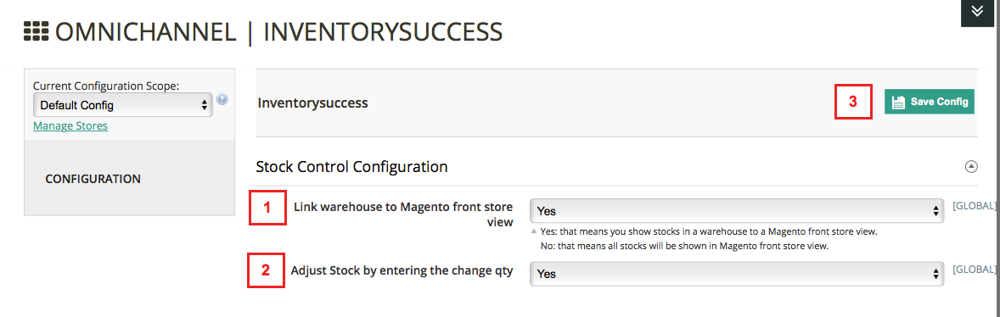

1. **Link warehouses to Magento front store view**: In managing a Warehouse, you can link Warehouse to a Front Store View (path: **Stock Listing > Warehouses >** Click **View > Warehouse Information** section **> General Information** tab **> Magento Store View** field). Note that you can link a warehouse to one or multiple store views.

* If you enable **Link warehouse to Magento Front Store View** by choosing **Yes** here, stock in warehouse will be displayed on the linked store view. When customers buy on this store view, stock quantity will be deducted from this linked warehouse.

* If choose **No**, stocks in all warehouses will be shown on the store view. 

2. **Adjust Stock by entering the change qty**: 

* if you choose **Yes**, when you enter the difference quantity (either a positive or negative figure), the system will calculate the final balance in warehouse by adding/ subtracting the entered value.

* If you choose **No**, you need to enter the exact quantity of stock in warehouse and the system will recognize this figure as the latest available quantity of product.

3. Click **Save Config** to finish

#### Inventory Option

##### Stock Options

_Path: **System > Configuration > Catalog** section **> Inventory > Stock Options**_

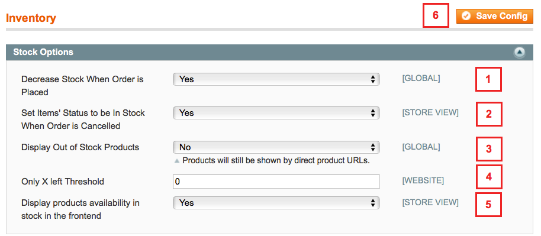

1. **Decrease Stock When Order is Placed**: Select **Yes** in the dropdown list to adjust the quantity on hand when an order is placed.
2. **Set Items’ Status to be In Stock When Order is Cancelled**: Select **Yes** in the dropdown list to return items to stock if an order is cancelled.
3. **Display Out of Stock Products**: Select **Yes** in the dropdown list to display products in the catalogue that are no longer in stock. 
4. **Only X left Threshold**: Enter the number in the blank to display the message: **Only x left** on website when the quantity in stock reaches the threshold.  
5. **Display products availability in stock in the frontend**: Select **Yes** in dropdown list to display an **In Stock** or **Out of Stock** message on the product page.
6. Tap **Save Config** to finish

##### Product Stock Options

_Path: **System > Configuration** section **> Catalog > Inventory > Product Stock Options**_

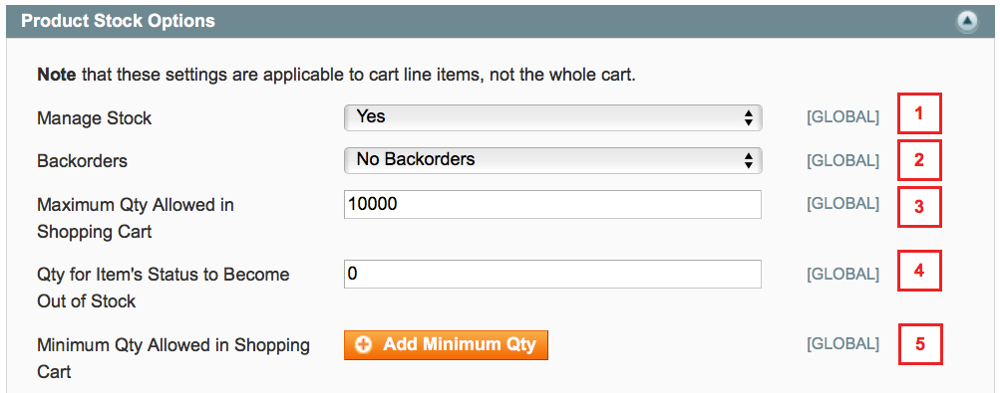

1. **Manage Stock**: Select **Yes** to activate inventory control for your catalog. 

2.	**Backorders**: Backorder is an order for a product that is temporarily out of stock with the supplier. Set Backorders to one of the following status: 

*	**No Backorders**: To reject backorders when product is out of stock.

*	**Allow Qty. Below 0**: To accept backorders when the quantity falls below zero. 

*	**Allow Qty. Below 0 and Notify Customer**: To accept backorders when the quantity falls below zero, and notify the customer that the order can still be placed.

3. **Maximum Qty Allowed in Shopping Cart**: Enter the **Maximum Qty.** allowed in Shopping Cart

4. **Qty for Item’s Status to Become Out of Stock**: Enter the quantity for Item's Status to become out of stock.

5. **Minimum Qty Allowed in Shopping Cart**: Enter the **Minimum quantity** allowed in Shopping Cart.

Next,

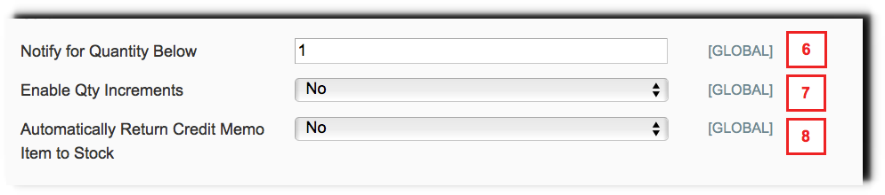

6. **Notify for Quantity Below**: Enter the stock level that generates notification showing the item is out of stock.

7. **Enable Qty Increments**: Select **Yes** to activate quantity increments for the product. Then in the **Qty. Increments** field, enter the number of the items that must be purchased to meet the requirement mentioned above.

8. **Automatically Return Credit Memo Item to Stock**: Select **Yes** to return the item to inventory by default when a credit memo is issued for the item.

Finally, click on **Save Config** to save changes. 

### Web POS

#### Add New POS and Assign it to Cashier

##### Create New POS

_Path: from **Magento backend > Sales > Web POS** section **> Manage POS**_

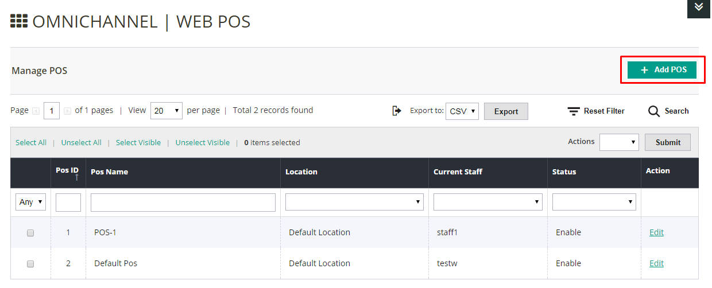

Click on **Add POS** button, then you will be linked to the New POS site 

There are 3 tabs to manage: **POS Information, Closed Session, Current Sessions Detail**

**•	Pos information**

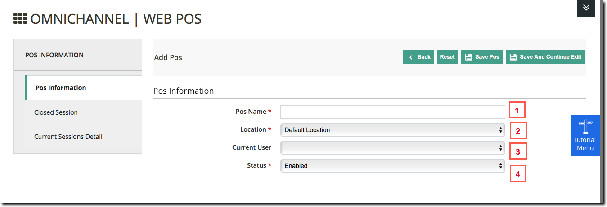

1.	**Pos Name**: POS’s Name
2. **Location**: POS’s location. Note that multiple POS can link to one location. Here, admin can choose location created and mapped to Warehouse. As a result, admin can control both Warehouse and Location easily. 
3. **Current User**: User is working on POS 
4. **Status**: users can **Enable** or **Disable** this POS

**•	Closed Session**

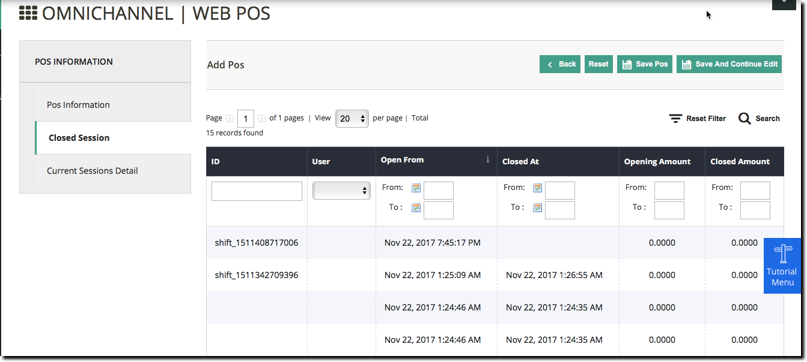

This section will display the statistics of Closed Session after staff working days like this picture above 

**•	Current Sessions Detail:** 

This section will show users detailed statistic of Current Session such as **Opening Balance** (the amount of money when staffs started their shifts), **Theoretical Closing Balance, Real Closing Balance**…

But with the brand new POS, no data is available to display.

##### Assign New POS to Cashier

_Path: **Sales > Web POS** section **> Web POS Permission > POS Users**_

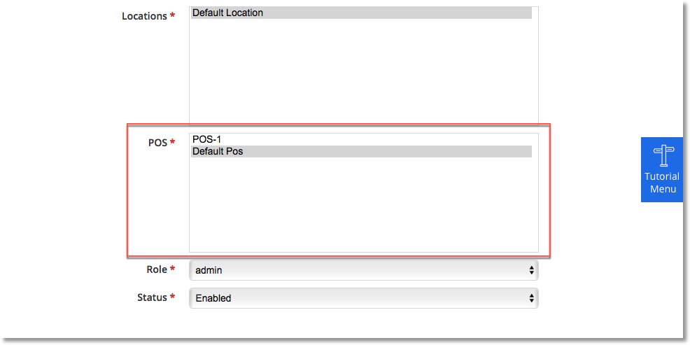

Here you can assign several POS to a staff

#### Manage POS Users & POS Roles 

#####	Decentralize POS Users 

_Path: from **Magento backend > Sales > WebPOS > Web POS Permissions > POS Users**_

###### Edit existing POS Users 

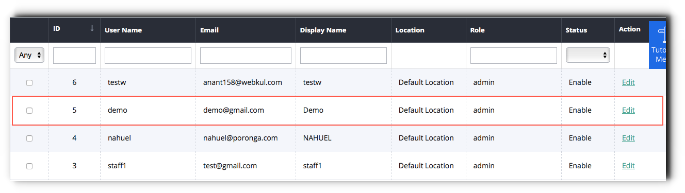

Users can click on **Edit** to view and change the POS users’ data. Then, 2 sections will be displayed which are **User Information** and **User Settings**

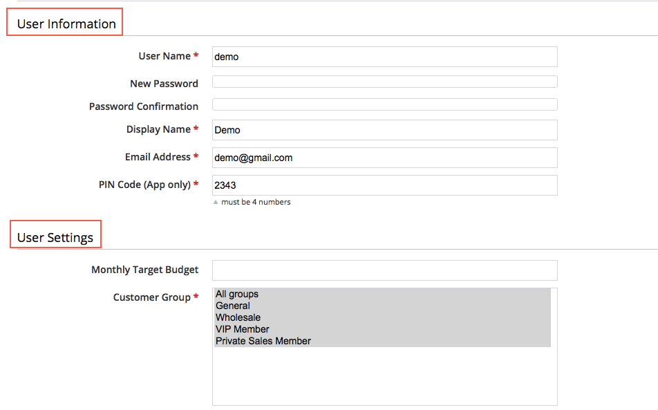

**•	User Information**

In this field, users can change user name, password, display name, email address as well as PIN code required when staffs opened new session. 

**•	User Settings**
 
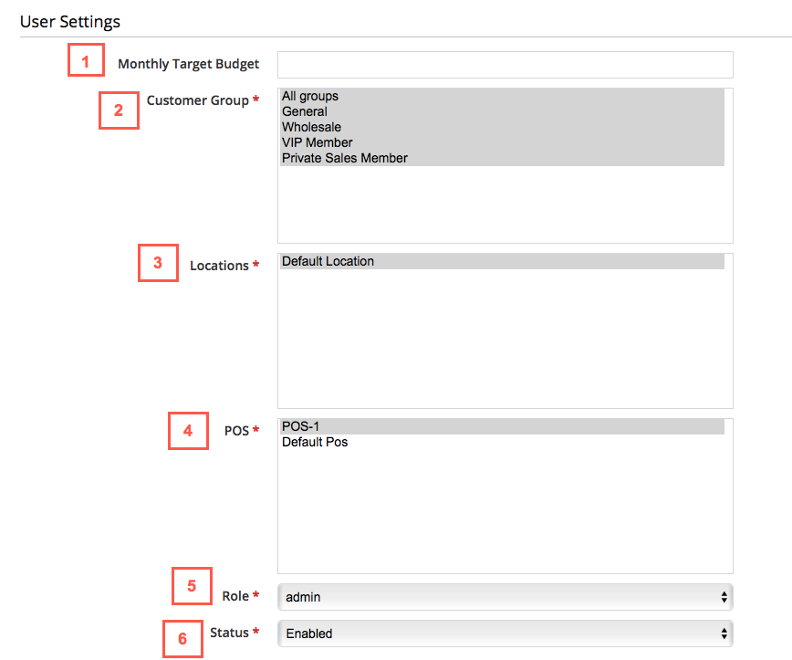

1. **Monthly Target Budget**: KPI each month for this user
2. **Customer Group**: admin can select among those choices 
3. **Locations**: choose the place where this staff is working 
4. **POS**: the POS which this staff is working with 
5. **Role**: Position of this staff 
6. **Status**: admin selects **Enable** to activate this staff account on system or selects **Disable** to prevent him/her from accessing POS

###### Add New POS Users 

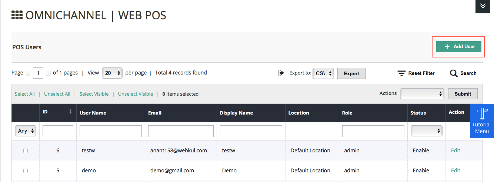

Click **Add User** on the right side of the screen.

2 sections, which are **User information** and **User settings**, will be displayed for admin to fill in data – the same as when you Edit an Existing POS User above.

##### Decentralize User Roles 

_Path: **Sales > WebPOS** section **> Web POS Permission > For Roles**_

###### Edit and Adjust Existing Roles on System

After following this path, a home screen listed different roles on system will be appear like the picture below

For example, in this picture, the only one role being active on the system is admin. 

Click on **Edit** under **Action** column to change the decentralization for this role. 

After clicking on **Edit**, you can edit user role in 2 tabs: **Role information** and **User list**

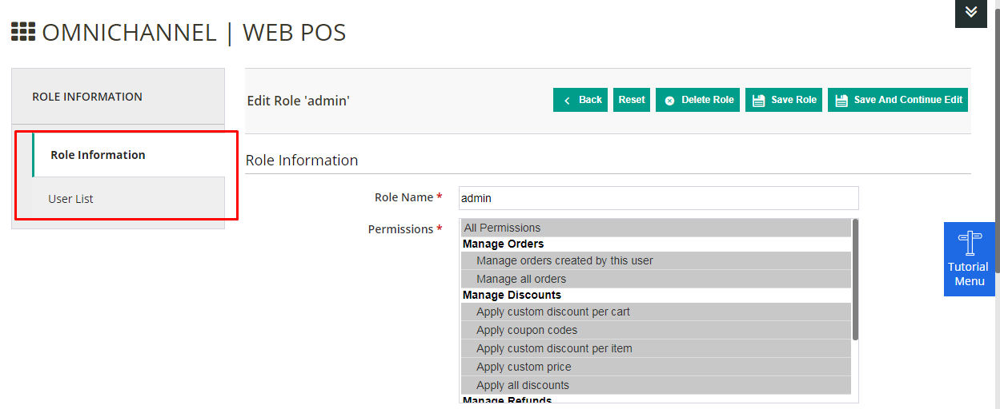

•	**Role Information** tab
 
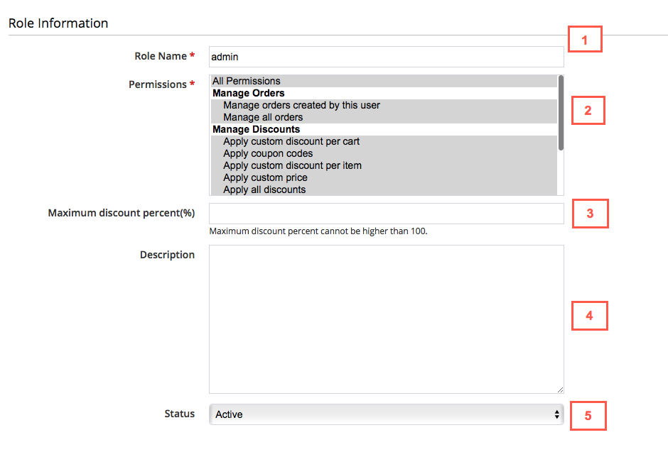

1. **Role Name**: you could change the name of role if it were essential 
2. **Permissions**: Click to decentralize permission for this role. Hold Shift + Click to select multiple. 
3. **Maximum discount percent**: the highest rate of discount which this role could apply for customers. 
4. **Description**: this field is optional. You can write some words to help your staffs know more about position description
5. **Status**: Select **Active** to active this role or select **Inactive** to limit all the permissions you set.

•	**User List** tab
 
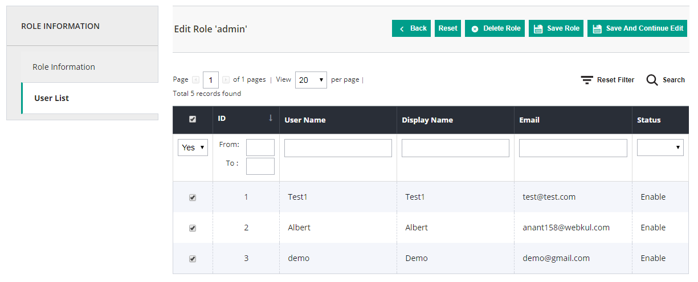

The list of users on the system who have this role 

For example, as we can see on the screenshot, user names **Test1, Albert & Demo** have the same role as **admin** on this system. 

###### Add New Role On System 

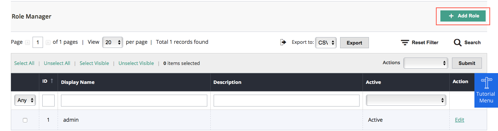

Click on **Add Role** button. Then, fill in the role’s information in **Role Information** tab just like above. Then click **Save Role** to apply the changes.

#### Differentiate Access Permission

_Path: **Sales > Web POS** section **> Web POS Permission > POS Roles**_ 

Please refer to **<a href="#decentralize-role">Decentralize User Roles</a>** for detailed instruction.

#### General Settings

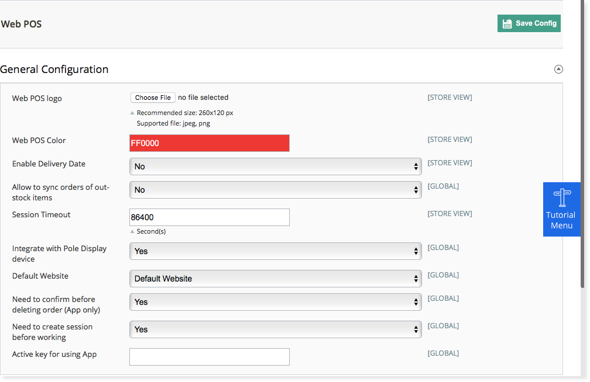

*	**Web POS Logo**: Upload your own logo here. Notice that the recommended size is 250x250px and supported files are jpg, png.

*	**Web POS Color**: Users can choose any colors they like and adjust them freely 

*	**Enable Delivery Date**: displays a field allowing cashier can input the date when customers receive products

*	**Allow to sync orders of out-of-stock items**: Choose between Yes or No

*	**Session Timeout**: After this period of time, users need to log in again to continue using POS account (please input the time in second) 

*	**Intergrate with Pole Display device**: Choose **Yes** or **No**. 

*	**Need to confirm before deleting order (App only)**: This setting is only applicable for [RetailerPOS](https://www.magestore.com/retail-pos/) – our POS version for ipad/tablet. Choose Yes or No

*	**Need to create session before working**: Select **Yes** or **No**. Sessions helps users manage process better when requiring input the amount of cash at the beginning or in the end of session. 

*	**Active key for using App**: This setting is only applicable for RetailerPOS where you can enter the key to start using [RetailerPOS](https://www.magestore.com/retail-pos/)

#### Default Guest Checkout 

_Path: **Sales > Web POS** section **> Settings > Default Guest Checkout**_

Default customer contains information that is used for Guest Checkout or when customer information is not enough, default input data will be filled automatically. 

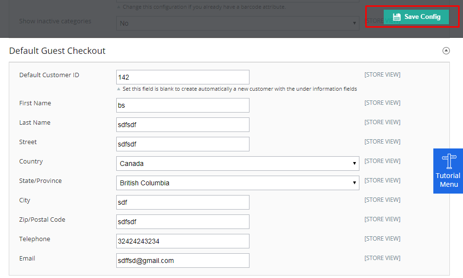
 
Fill in those fields which you want to use as default data such as **First Name, Last Name, Street, Country, State/Province, City, Zip Code, Telephone or email**. 

After filling in, don’t forget to click **Save Config** button to save your changes

#### Enable Payment Method 

_Path: **Sales > Web POS** section **> Settings > Payment for POS**_

There are 3 sections to configure: The first one is **General Payment Setting** and others are **Integration** (for [RetailerPOS App](https://www.magestore.com/retail-pos/) – our POS version for ipad/tablet only which you can skip for this Starter package)

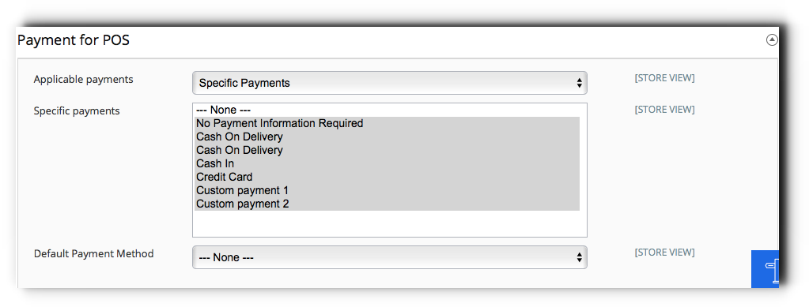

•	**General Payment Setting**
1. **Applicabale Payments**: users can select **Allowed all payment methods** or **Specific Payments**. The latter selection means that your system will only accept some methods which are listed in the field **Specific Payments** below
2. **Specific Payments**: users can choose among those choices such as **Cash On Delivery, Cash In, Credit Card**. Hold **Shift + Click** to select more than one method. These options are only available here when you enable them in **System > Configuration > Sales** section **> Payment Method**
3. **Default Payment Method**: select the option that will appear automatically in the field of payment method when cashiers checkout for customers. 

•	**Paypal Integration (App only)** and **Authorizenet Integration (App only)**: include settings for Paypal, Stripe or Vantiv for [RetailerPOS App](https://www.magestore.com/retail-pos/) – our POS version for ipad/tablet only which you can skip for this Starter package

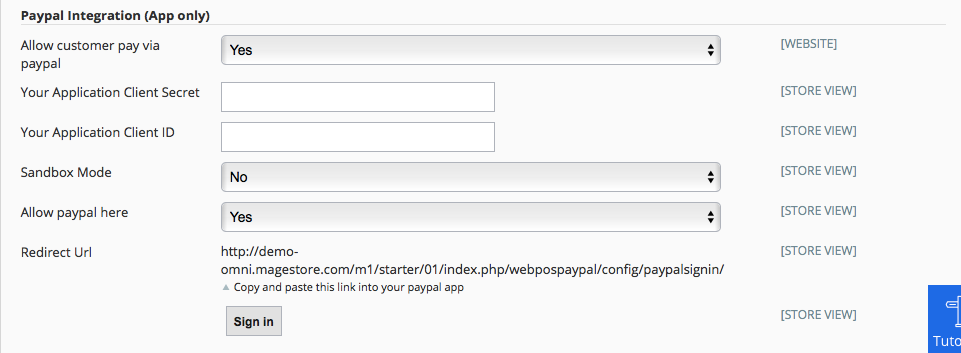

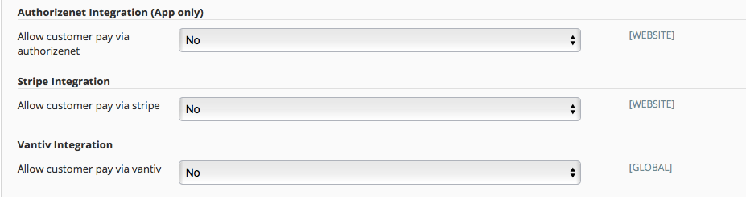

#### Set up Shipping Method 

_Path: **Sales > Web POS** section **> Settings > Shipping for POS**_

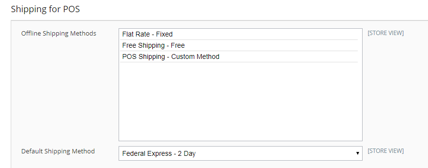
 
•	**Offiline Shipping Methods**: users can choose among those options: **Flat Rate, Free Shipping, Custom Method**. These options are only available here when you enable them in **System > Configuration > Sales** section **> Shipping Method**
•	**Default Shipping Method**: Choose the shipping method that you would want to set as default payment method during checkout WebPOS.

#### Configure Product Search

_Path: **Sales > Web POS** section **> Settings > Product Search**_
 
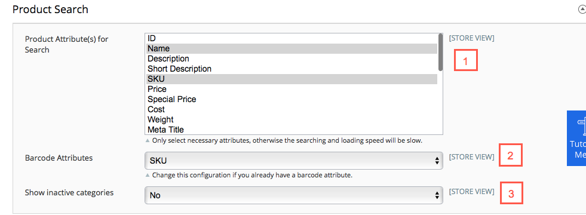

1. **Product Attributes for Search**: Select attributes by which you want to search products. The default attributes are **Name** and **SKU**. Users can choose among those selections. Hold **Shift +Click** to select more than one 
2. **Barcode Attributes**: Choose SKU to search products quickly (only applicable if you have a barcode attribute which you can skip in this Starter Package). 
3. **Show inactive categories**: Select **Yes** or **No** to display inactive categories in WebPOS frontend.

#### Set Up Default Email 

This configuration includes 4 types of email relating to 4 different process i.e. **Orders, Invoices, Shipments** and **Credit Memos**

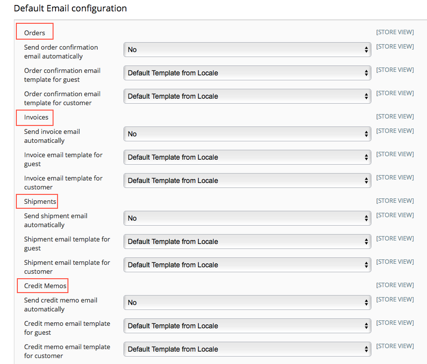
 
This section of configuration allows you to send customers automatic email to confirm orders, receive invoices, confirm shipment as well as credit memos.

#### Receipt Printing Configuration

There are 3 parts to configure which are: **General, Content, Optional Fields**
 
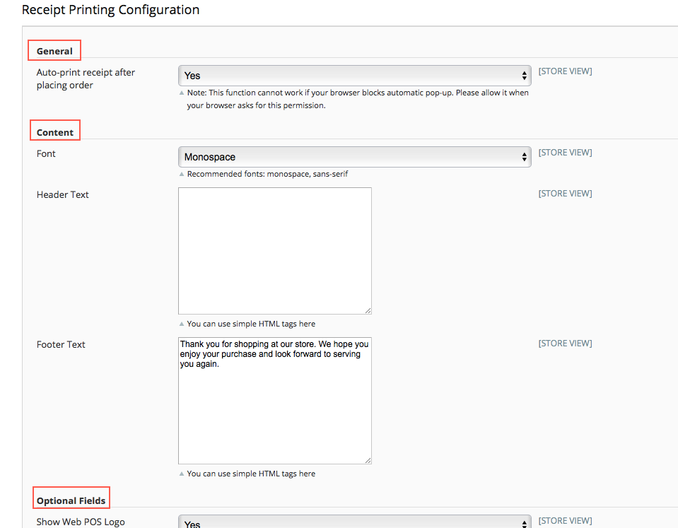

1. **General**: users can select **Yes** or **No** to active the function which is printing automatically receipt after an order is successfully placed.

2. **Content**: here you can customize the content of the receipt. 
* Users can choose default font of text
* Header Text: Please fill in the content which you want to appear in the heading section
* Footer Text: Type the content which you want to appear in the footer section 

3.	**Optional Fields**

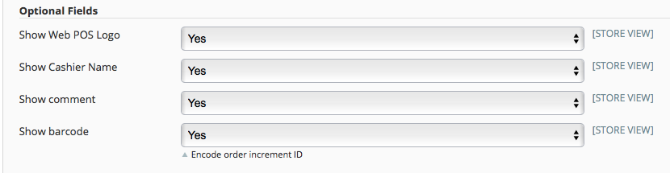
 
Users can select between **Yes** or **No** to show those items such as Web Pos Logo, Cashier Name, Comment or Barcode. 

#### How Web POS works with Peripheral Device 

Magestore Web POS module can connect with **Barcode Readers, Card Swipers and Receive Printers**

*	**Barcode Readers**: are any devices which can connect with Ipad/Laptop/PC (including USB Port, Wifi or Bluetooth). The scanner reads barcodes and fill encoded information into Web POS search box 
*	**Card Swipers**: only devices connected through USB port (Supports Authorize.Net & Stripe) 
*	**Receive Printers**: any devices connecting with Ipad/Laptop/PC

## HOW TO MANAGE USER PERMISSION

**Note**: Only admin accessing Web POS can set up Staff permission

### How to manage User Roles and Users

**Note**: Users are the one who get permission to access in the Backend

#### Decentralize User Roles

_Path: **System > Permission** section **> Roles**_

##### Manage user role

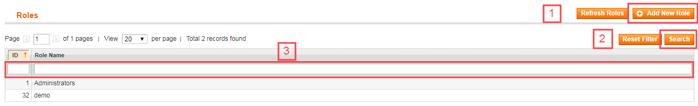
 
1. Click **Add New Role** to create new user role.

2. Fill out the blank with a value to search, after click **Search**.

3. Search user role information with keyword.

View or edit a role’s detail by clicking on each line.

##### Create a new user role

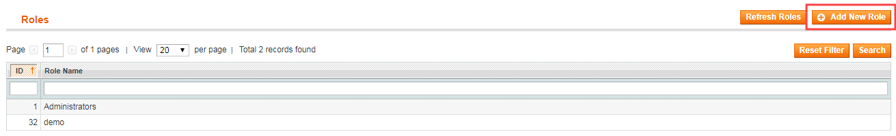
 
Click **Add New Role**
 
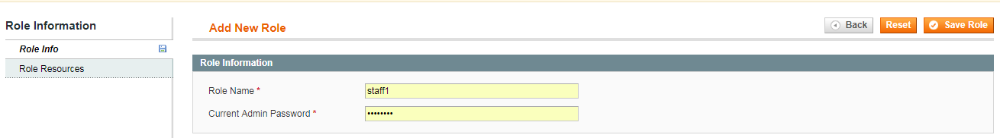

In tab **Role Info**, fill in all required fields including role name and admin password.
 
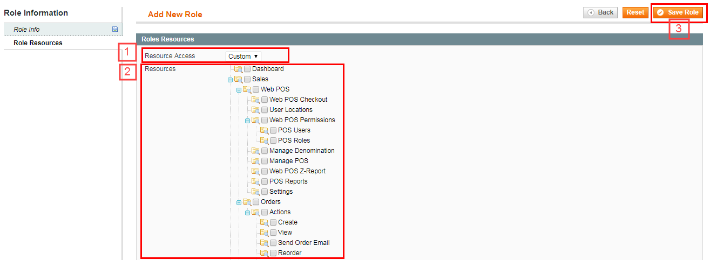 
 
In tab **Role Resources**:

1. **Resource Access**: You can choose **Custom** or **All**. Choose **All** if you want users having this role will have access to all resources, click on **Save** or **Save And Continue Edit** button to save your work.
2. If you choose **Custom**, you can tick to assign specific permissions for that role.
3. Click **Save** to complete the process.

#### Decentralize Users

_Path: **System > Permission** section **> Users**_

##### Manage user

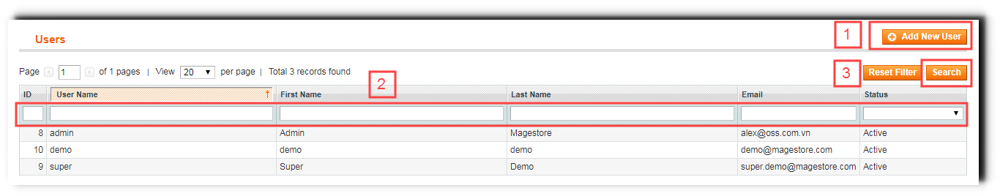 
 
1. Click **Add New User** to create new user.
2. Fill out the blank with a value to search
3. Click on **Search** button to search user information with keyword.

View or edit a user’s detail by clicking on each line.

##### Create a new user
 
  
 
To create new user, click **Add New User**
 
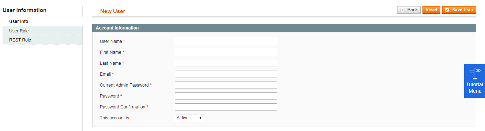 

In tab **User Info**, fill in the required information.
 
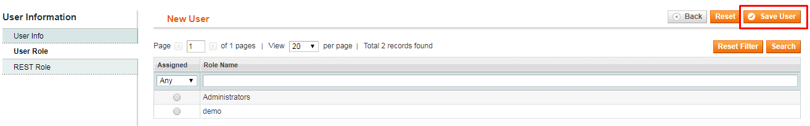 

In tab **User Role**, select a role for user. Then click **Save User** to complete the process

### How to manage POS staff

#### Decentralize access permission of Web POS users

_Path: **Sales > Web POS** section **> Web POS Permissions > POS Roles**_

##### Manage role

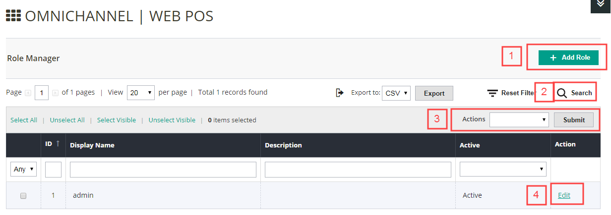 
 
1. **Add Role**: Click to add a new role.
2. **Search**: You can find role information by click it and fill out values.
3. **Action**: If you want to delete a role record, you need choose a role, then select Delete option and click **Submit**.
4. **Edit**: You can view role’s details (edit) by click **Edit**.

##### Add a new role
 
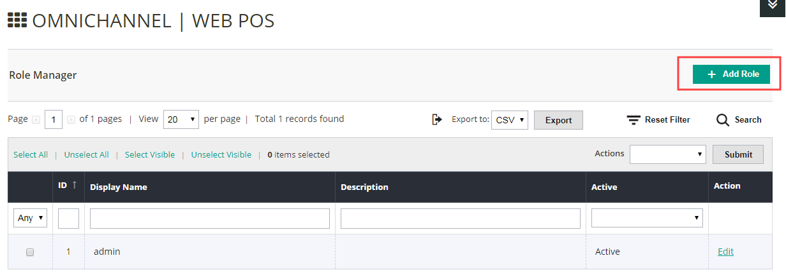 

Click **Add Role** to add a new role.

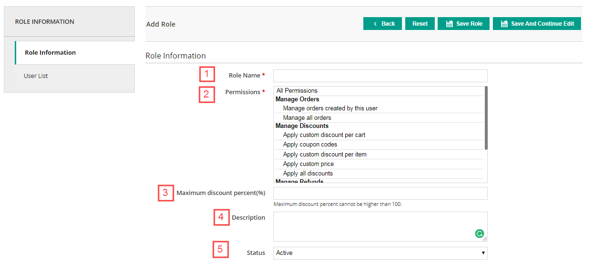 
 
In **Role Information** tab, fill out the blank.

1. **Role Name**: Enter a name for the role. (required)
2. **Permissions**: Choose **All Permissions** if you want the user to have access to all resources. Or select a specific role. Hold **Ctrl + Click** to select multiple.
3. **Maximum discount percent (%)**: Limit the highest discount percent that each user role can offer customers.
4. **Description**: Enter text that describes the role.
5. **Status**: select **Active** to activate this role.

Then, click on **Save Role** or **Save and Continue Edit** to save your changes.

#### Decentralize POS user

##### Manage User

_Path: **Sales > Web POS** section **> WebPOS Permissions > POS Users**_

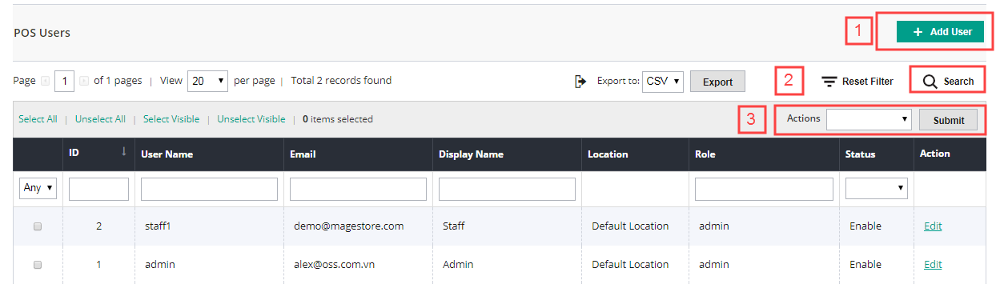 
 
1. Click **Add User** to create a new user.
2. Click **Filters** to search user information.
3. If you want to Delete or Change status a staff, first select a staff, then choose **Delete** or **Change status** and click **Submit**.

Click **Edit** under **Action** column to view a staff’s details or edit.

##### Create a new user

_Path: **Sales > Web POS** section **> WebPOS Permissions > POS Users**_

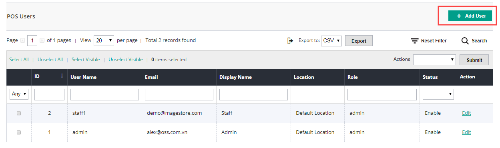 
 
Click **Add User**.

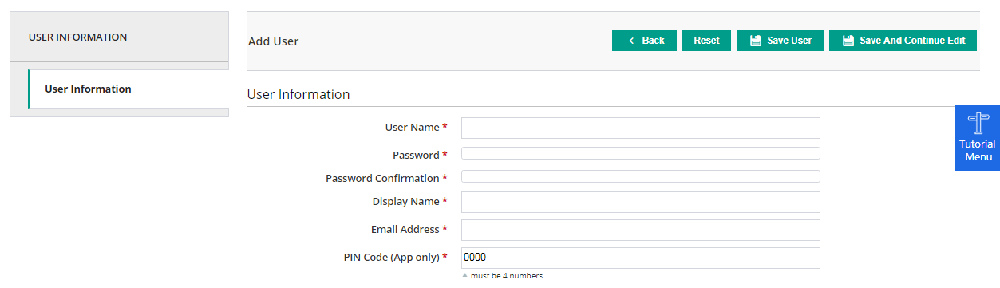 
 
Fill out all the required fields including: **User Name, Password, Password Confirmation, Display Name, Email Address**. The **PIN Code (App only)** setting is only applicable to RetailerPOS – our POS version for ipad/tablet which you can skip in this Starter package user guide.

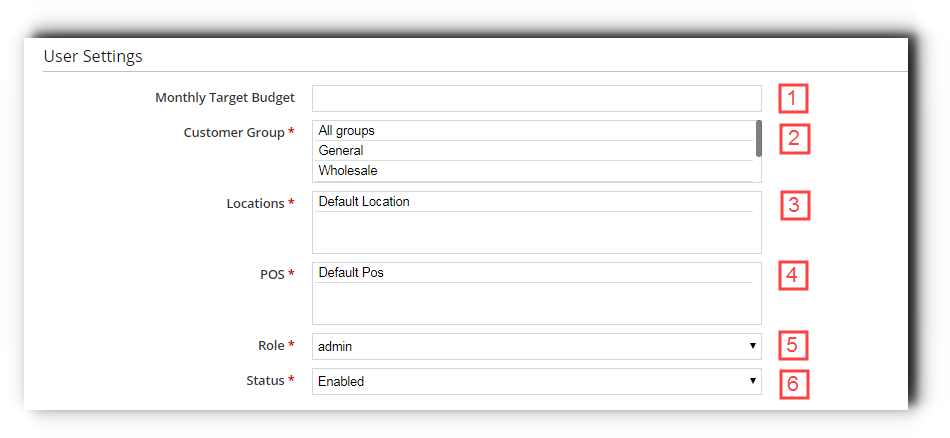 
 
1. **Monthly Target Budget**: set the monthly target for the user
2. **Customer Group**: choose the group for the customer from the list
3. **Location**: Assign a Location for the user.
4. **POS**: Assign POS for the user.
5. **Role**: choose the user’s role
6. **Status**: You can Enabled or Disabled this staff.

Finally, click **Save** to complete the process.

## HOW TO MANAGE MASTER DATA

### Product

#### Attribute

_Path: **Catalog > Attributes** section **> Manage Attributes**_

##### Manage Attribute 

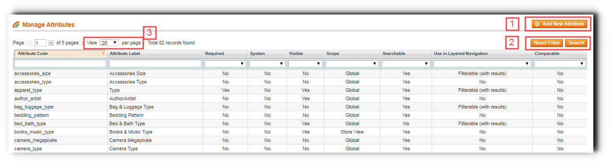 
 
1. Click **Add New Attribute** to create new user.
2. Number of products to be display per page 
3. Search attribute information with keyword.

You can view or edit attribute’s details by clicking on each line

##### Create A New Attribute 

Attributes can be created while working on a product, or from the Product Attributes pages. The following example shows how to create attributes from the Stores menu. Any attribute that is used as a drop-down list of values for a configurable product must have the following properties:

| Property |	Value |
| --- | --- |
| Catalog Input Type for Store Owner	| Dropdown| 
| Scope	| Global |

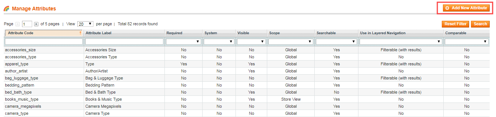  
 
Click **Add New Attribute**
 
###### Properties tab:

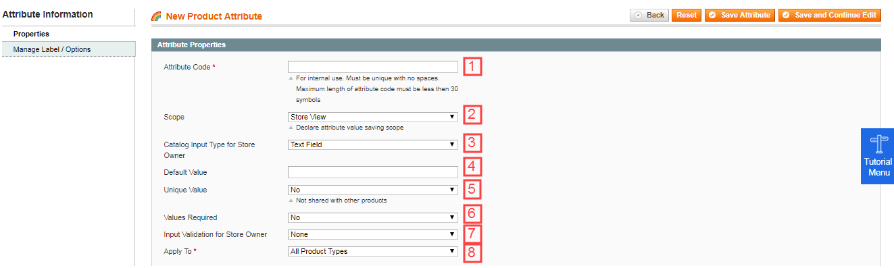  

**•	Attributes Properties**

1. Enter a unique **Attribute Code** in lowercase characters, and without space
2. Set **Scope** to indicate where in your store system the attribute can be used
3. Set **Catalog Input Type** for Store Owner to the type in input control to be used for data entry
4. Enter a **Default Label** to identify the attribute
5. If you want to prevent duplicate values from being entered, set **Unique Value** to **Yes**
6. Select Yes to require the customer choose an attribute value option
7. To run a validity test of any data entered in the text field, set **Input Validation for Store Owner** to the type of data that the field should contain. This field is not available for input types with values that are selected. The test can validate any of the following:
* _Decimal Number_
* _Integer Number_
* _Email_
* _URL_
* _Letters_
* _Letters (a-z, A-Z) or Numbers (0-9)_
8. Select if the attribute setting is applied to all product types or only selected type(s). Hold Ctrl + Click to select multiple 

**•	Storefront Properties**

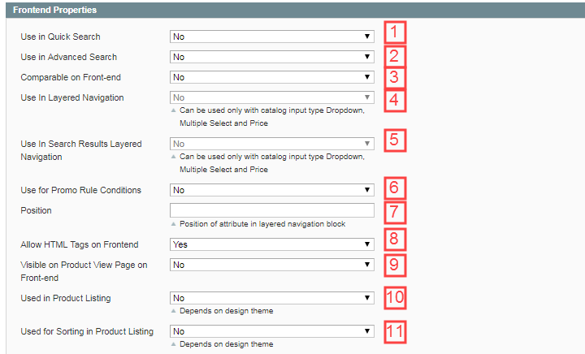 
 
1. If the attribute is to be available for search on website, set **Use in Quick Search** to **Yes** 
2. If the attribute is to be available for advanced search tool on website, set **Use in Advanced Search** to **Yes**
3. To include the attribute in Product Compare, set **Comparable on Frontend** to **Yes**

For dropdown, multiple select and price fields, do the following: 

4. To use the attribute as a filter in layered navigation, set **Use in Layered Navigation** to **Yes**
5. To use the attribute in layered navigation on search results pages, set **Use in Search Results Layered Navigation** to **Yes**
6. Set **Use for Promo Rule Conditions** to **Yes** to use the attribute in price rule.
7. In the **Position** field, enter a number to indicate the relative position of the attribute in the layered navigation block.
8. To allow the text to be formatted with HTML, set **Allow HTML Tags on Frontend** to **Yes**. This setting makes the WYSIWYG editor available for the field. 
9. To include the attribute in catalog page listings, set **Visible on Catalog Pages on Storefront** to **Yes**
10. Complete the following settings if supported by your theme:
* To include the attribute in product listings, set **Used in Product Listing** to **Yes**
* To use attribute as a sort parameter for product listings, set **Used for Sorting in Product Listing** to **Yes**

###### Manage Labels / Options
 
  
 
In tab **Manage Labels**: Enter a **Title** to be used as a label for the field. If your store is available in different languages, you can enter a translated title for each view.

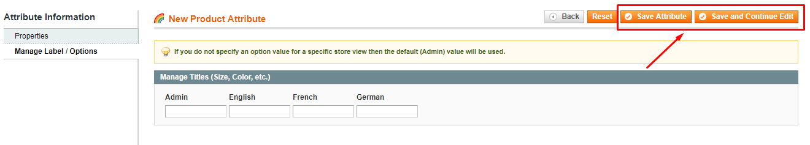  
 
When complete, click **Save Attribute** or **Save and Continue Edit**.

#### Attribute Set 

_Path: **Catalog > Attributes** section **> Manage Attribute Sets**_

##### Manage Attribute Set
 
  

1. Click **Add New Set** to create new attribute set.
2. Fill out the blank with a value to search,.
3. Click **Search** to start your search or clear the filter field.

You can view or edit details of attribute set by clicking on each line.

##### Create A New Attribute Set

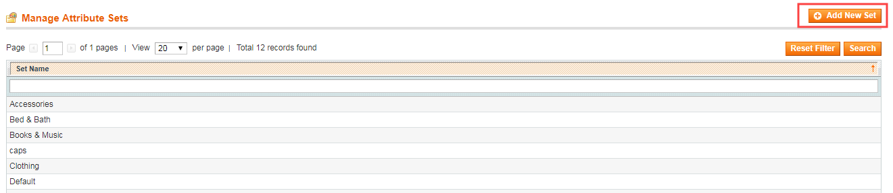  
  
Click **Add New Set** button to create new attribute set.

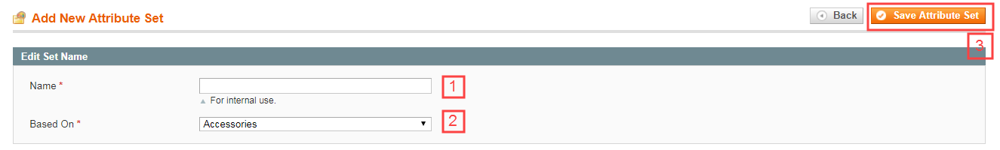  
 
1. In the **Name** field, enter a name for the attribute set (required)
2. In the **Based On** field, select an existing attribute set to be used as a template:
*	Bag
*	Bottom
*	Default
*	Downloadable
*	Gear
*	Sprite Static Ball
*	Sprite Yoga Strap
*	Top

3. Click **Save Attribute Set** button and continue

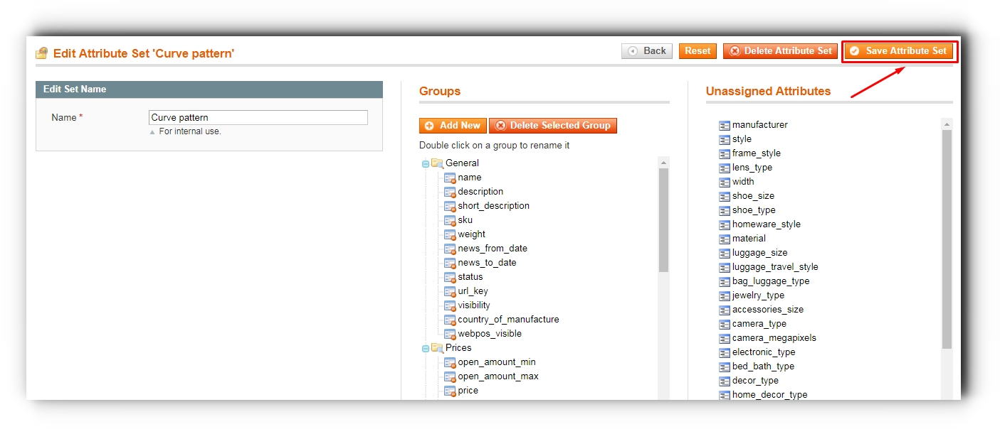  
 
To add a new attribute to the set, drag the attribute from the **Unassigned Attribute** list to the appropriate folder in the **General** group.

Click **Save Attribute Set** to complete the process.

#### Categories

_Path: **Catalog > Manage Categories**_

##### Manage Categories  

When selecting a category on the left, all the information will be displayed on the left.

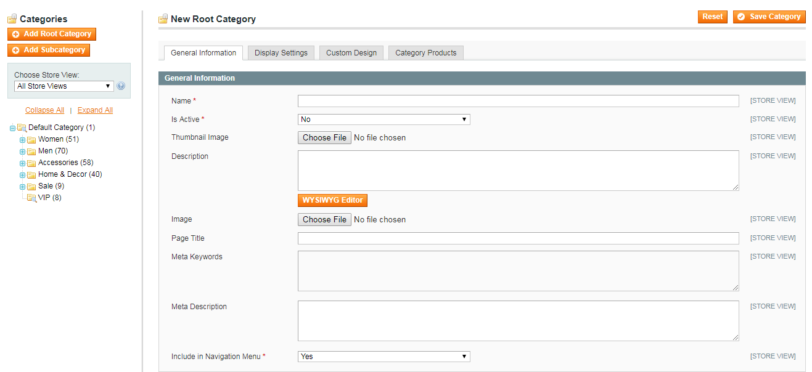  
 
##### Create A New Category

_Path: **Catalog > Manage Categories**_

Set **Store View** to determine where the new category is to be available. In the category tree, tap the parent category of the new category.

If you’re starting without any data, there might be only **Default Category**, which is the root. 

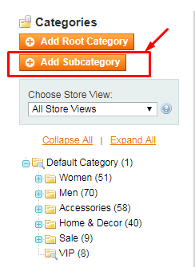  
 
Click **Add Sub-category** to add a new category.

**•	General Information tab**

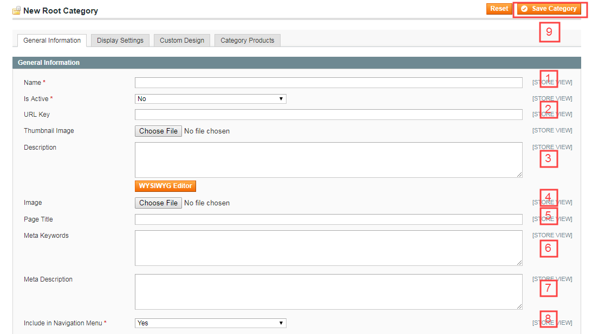  
 
1. Enter the Category Name
2. If you want the category to be immediately available in the store, set **Is Active** to **Yes**
3. , 4., 5., 6., 7. Enter **SEO-related** fields (optional)
8.	To include the category in the top navigation, set **Include in Navigation Menu** to **Yes**
9.	Click **Save Category** to finish

**•	Display Setting tab**
 
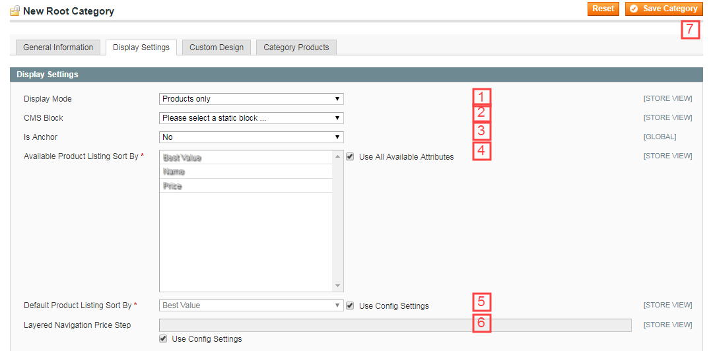   
 
1. Set **Display Mode** to one of the following:
* Products Only.
* Static Block Only.
* Static Block and Products.

2. To include a content block on the category landing page, choose the CMS Block that you want to appear
3. If you want the category page to include the **Filter by Attribute** section of layered navigation, set **Anchor** to the **Yes** position.
4. To change the **Available Product Listing Sort By** options, do the following: 
* Clear the **Use All** checkbox. 
* Select one or more of the available values to be available for customers to sort the list. By default, all available values are included. For example, the values might include:
- Position.
- Product Name.
- Price 5.
5. To set the default sort order for the category, check the **Use config setting** box.
6. To change the default **Layered navigation price step** setting, do the following:
* Clear the **Use Config Settings** checkbox.
* Enter the value to be used as an incremental price step for layered navigation.
7. Click **Save Category** to finish.

**•	Category Products tab**

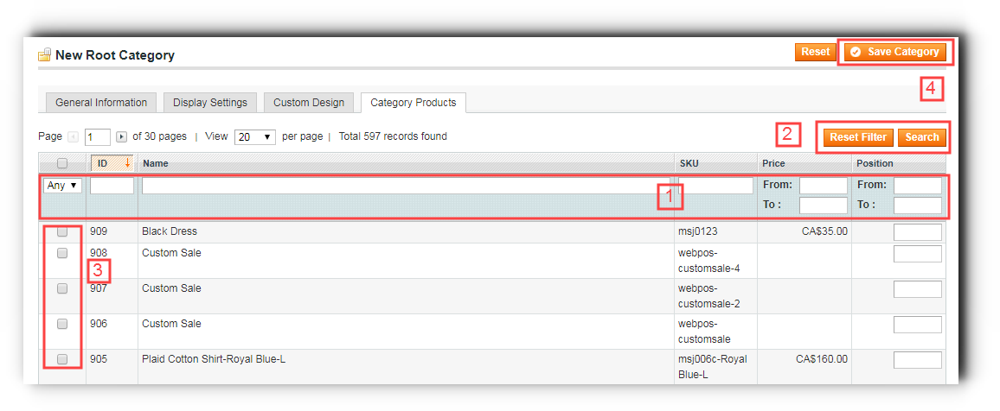  
 
To find the products:

1. Fill out the blank with a value.
2. Click **Search** to find the products.
To include a product in the category. 
3. Mark the checkbox of each product, in the first column.
4. Click **Save Category**

#### Product Types

_Path: **Catalog > Manage Products**_

##### Product Types 

| Product Types |	Description|
| --- | --- | 
| Simple Product	| A simple product is a physical item with a single SKU. Simple products have a variety of pricing and of input controls which makes it possible to sell variations of the product. Simple products can be used in association with grouped, bundle, and configurable products |
| Configurable Product	| A configurable product appears to be a single product with lists of options for each variation. However, each option represents a separate, simple product with a distinct SKU, which makes it possible to track inventory for each variation |
| Grouped Product	| A grouped product presents multiple, standalone products as a group. You can offer variations of a single product, or group them for a promotion. The products can be purchased separately, or as a group |
| Virtual Product	| Virtual products are not tangible products, and are typically used for products such as services, memberships, warranties, and subscriptions. Virtual products can be used in association with grouped and bundle products |
| Bundle Product	| A bundle product let customers “build their own” from an as sort of options. The bundle could be a gift basket, computer, or any things else that can be customized. Each item in the bundle is a separate, standalone product |
| Downloadable Product	| A digitally downloadable product that consists of one or more files that are downloaded. The files can reside on your server or be provided as URLs to any other server |

##### Manage Product 

_Path: **Catalog > Manage Products**_

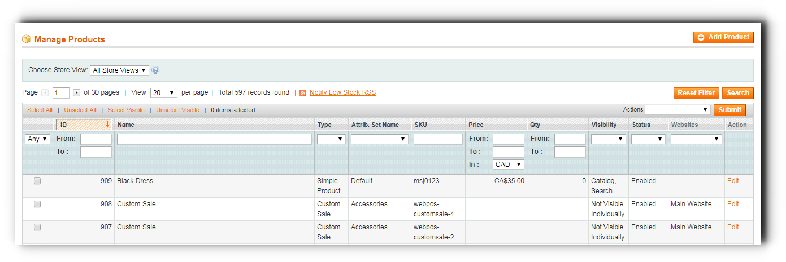 
 
**Workspace Controls**

| Control	| Description |
|	Add Product	| Initiates the process to create a new simple product. To choose a specific product type, click the down arrow. Options: Simple Product, Configurable Product, Grouped Product, Virtual Product, Bundle Product, Downloadable Product |
| Action	| Lists all actions that can be applied to selected products in the list. To apply an action to a product or group of products, mark the check box in the first column of each product. Options: Delete, Change Status, Update Attributes |
|	Filters	| Initiates a catalog search based on the current filters |
|	Edit	| Opens the product in edit mode or view product’s detail.  You can accomplish the same thing by clicking any where on the row |

##### Create A New Product 

 
 
Click **Add Product** button at the top right of the page. You will be directed to the **New Product** page where you can select the **Attribute Set** and **Product Type**. Then click **Continue** to process.

 
 

###### Simple product

There are several tabs to complete information for the product. But only **General, Prices** and **Inventory** tabs have required information that you have to fill before continuing.

**•	General tab**
 
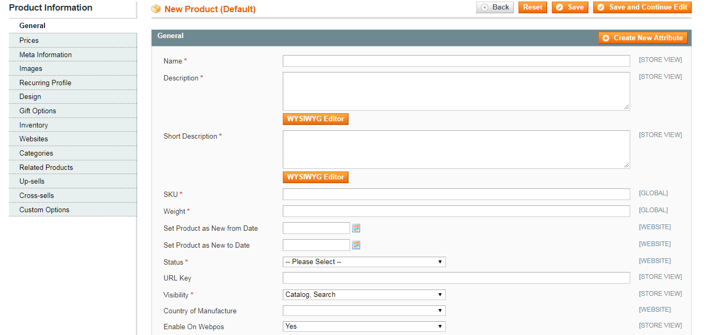 

Complete the required settings including **Product Name, Description, Short Description, SKU, Weight, Status & Visibility**. 

**NOTE**: you need to choose **Yes** in **Enable On WebPOS** setting to display this product in WebPOS frontend.

Then, Click **Save** to continue.

**•	Prices tab:** enter the product price and tax class (required)

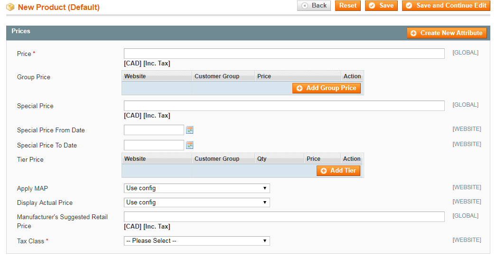 
 
**•	Inventory tab:** enter the Qty in stock of the product.

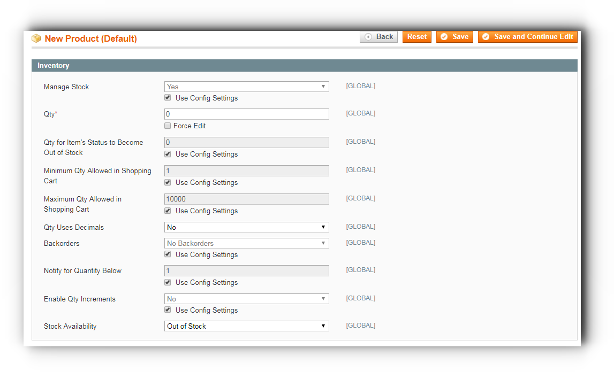 
 
Scroll down and complete the information in the following sections as needed:
 
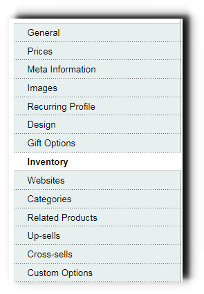 

###### Configurable product

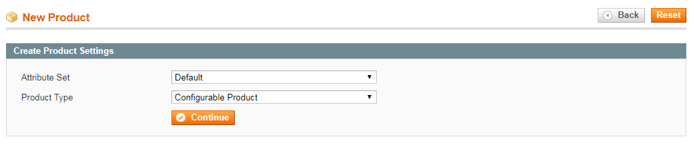 
 
In the **New Product** page, choose **Configurable Product**.

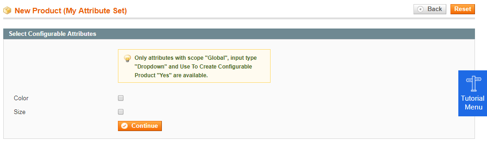 
 
Select the Attribute(s) and click **Continue**.

Complete required information in **General & Prices** tabs just like Simple Product and click **Save** or **Save and Continue Edit** to continue. Fill information in other tabs if you want to.
 
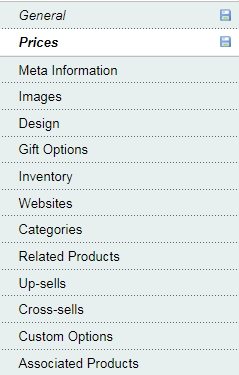 

**Adding configurations**

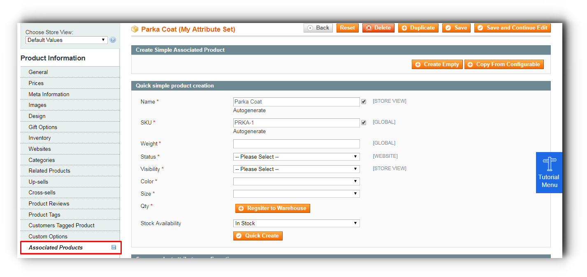 
 
After creating a product, go to **Associated Products** tab, you can use the **Quick Simple Product Creation** to add configurations for the product quickly and conveniently. 

###### Grouped product

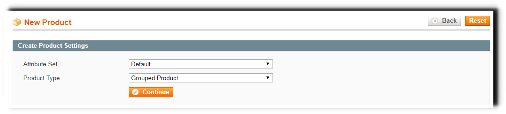 

In the **New Product** page, choose **Grouped Product**.

Complete required information in **General** tab just like Simple Product and click **Save** or **Save and Continue Edit** to continue. Fill information in other tabs if you want to.

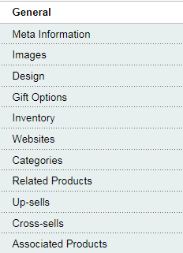 
 

**Add products to Group**

Tap on **Associated Products** at the bottom of the left menu to add products to group 
 
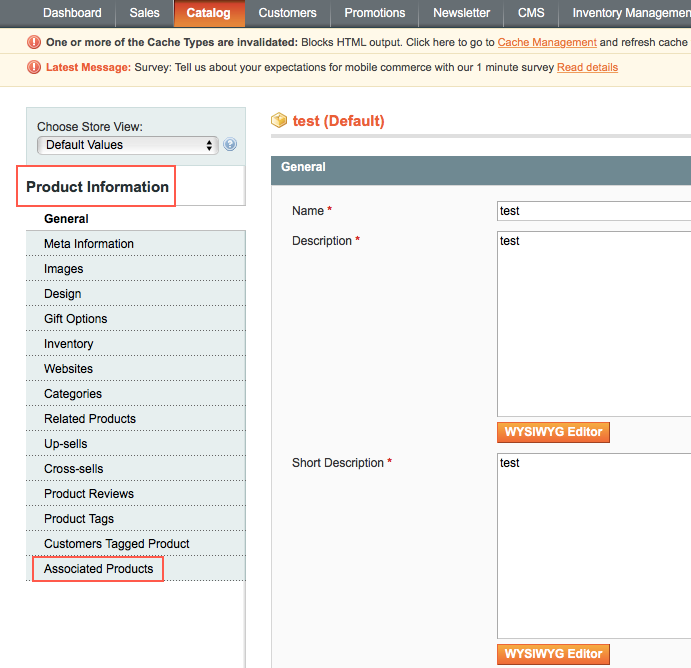 

A list of products will be displayed on the screen, users just need to click on them to add them to a specific group 

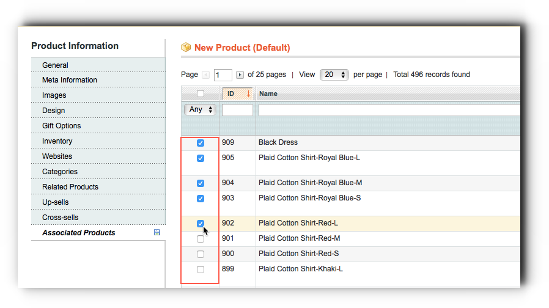 
 
And don’t forget to tap on **Save and continue edit** button at the right side of the screen to save your configuration 

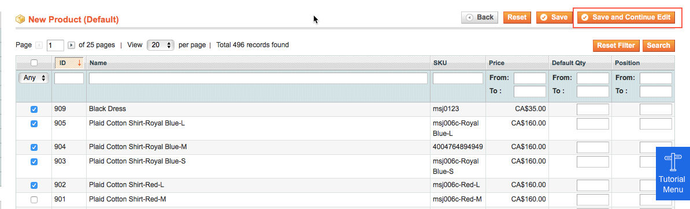  

###### Virtual product
 
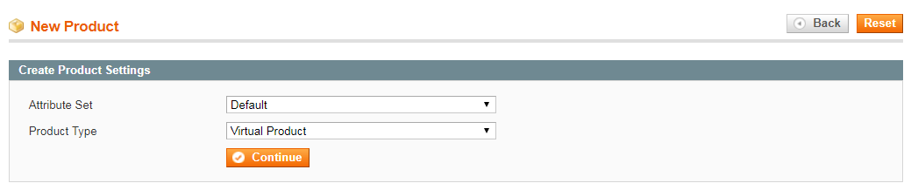  
 
Aside from the absence of the Weight field, the process of creating a virtual product and a simple product is the same.

###### Bundle product
 
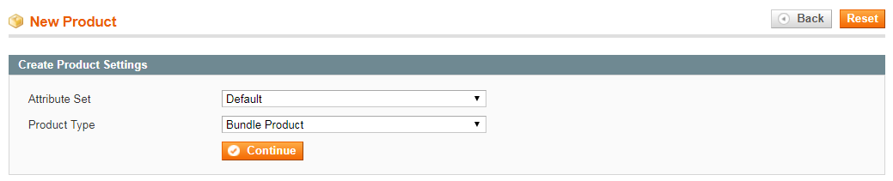 

In the **New Product** page, choose **Bundle Product**.

And then, the screen will be displayed like the screenshot below: 

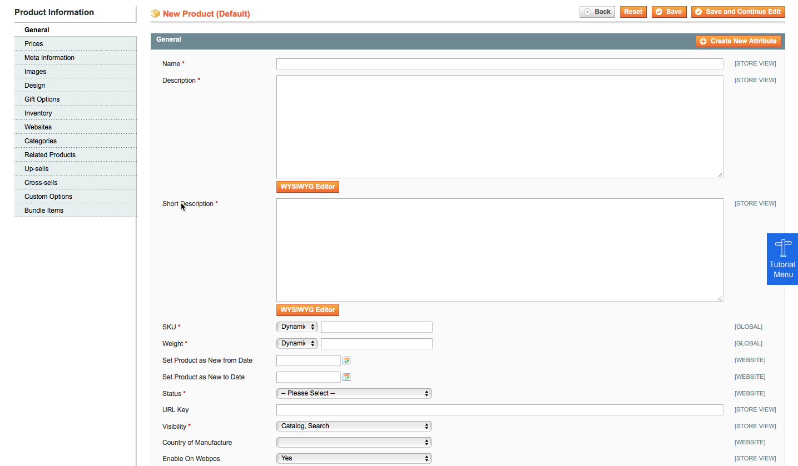 
 
There are many sections for users to enter product information on the left side of the screen: 
 
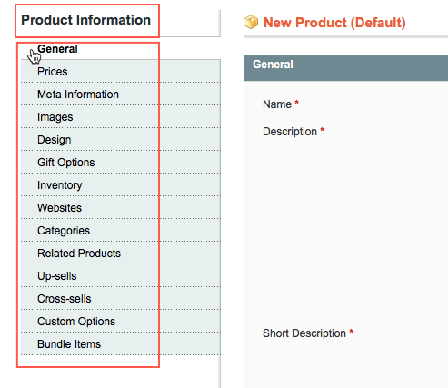 

In total, there are 14 sections for users to fill in such as **General, Prices, Meta Information, Images, Design, Gift Options, Inventory, Websites, Categories, Ralated Products, Up-sells, Cross-sells, Custom Options** and **Bundle Items**

And each section will be divided into several fields for users to fill in. Enter data for all of them to complete basic settings. 

**Add Bundle items**

In the left menu of the **New Product** page for Bundle Product, go to **Bundle Items** tab.

To configure shipment method for bundle items, select between 2 options which are: **separately** or **together**

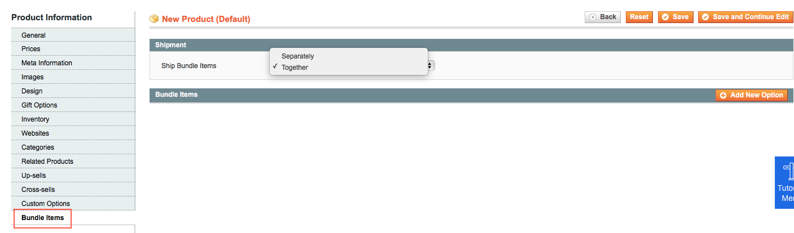 
 
Click **Add New Option**

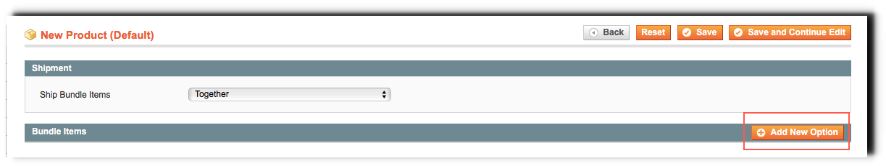 
 
Then, the screen will be displayed like the screenshot below: 
 
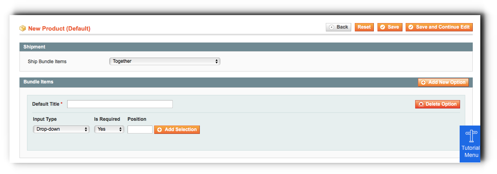 

*	**Default Title** to be used field label.
*	Set **Input Type** to one of the following:
-	Drop-down.
-	Radio buttons.
-	Checkbox.
-	Multiple Select.
*	Choose between **Yes** or **No** to make the field a required entry.
*	Tap the orange button **Add Selection**, then mark the checkbox of each product that you want to include in this option.

Mark the checkbox of each product to choose 
 
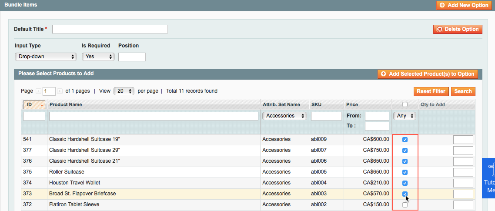 

Click **Add Selected Product(s) to Option**, you will see.
 
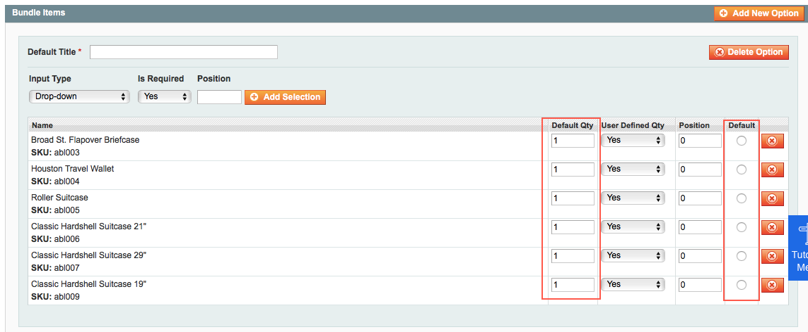  
 
- Mark the checkbox of a product that you want it is default.
-	Enter **Default Quantity**.

Finally, click **Save**.

###### Downloadable product
 
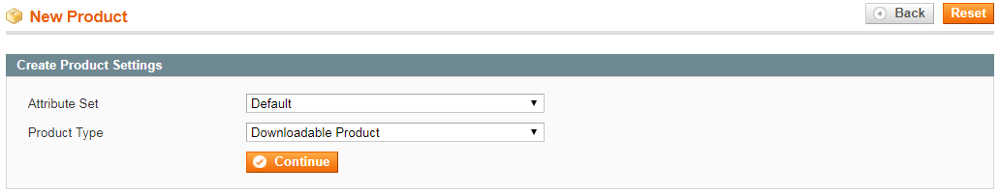 

In the **New Product** page, choose **Downloadable Product**.

You will be directed to a page with 14 sections for you to enter product data such as **General, Prices, Meta Information, Images, Design, Gift Options, Inventory, Websites, Categories, Related Products, Up-sells, Cross-sells, Custom Options** and **Downloadable Information**. 
 
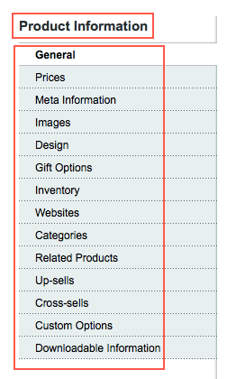 

In **General** section, the screen will be displayed like this: 
 
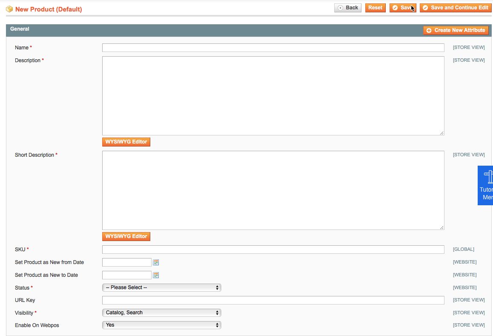  
 
Complete the required setting
*	Enter **Product Name**. (required)
*	Fill in the **Description** and **Short Description** for products
*	The default **SKU** that is based on the product name, or enter another
*	Set **Date** for product 
*	To set **Status**: Please choose between **Enable** or **Disable** 
*	Type in **URL Key** (optional) 
*	Choose **Visibility** for products
*	To **Enable on Webpos**, choose between **Yes** or **No**

Finally, don’t forget to click **Save** to continue.

**Add Downloadable Package**

In **Downloadable Information** Section, there are 2 parts for users to fill in: **Samples** and **Links**

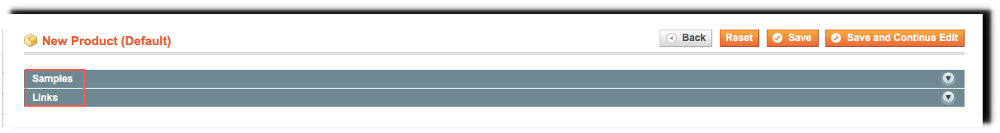 
 
To complete the **Samples** section: 

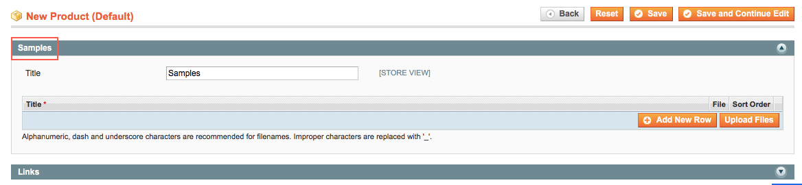 
 
*	Enter the **Title** - to use as a heading for the samples.
*	To enter the **Title** of the individual sample:

Tap on the orange button **Add New Row** and then choose between Upload file or paste the URL. Or users can tap on **Add New Row** button to add more samples. When completed, click **Save**.

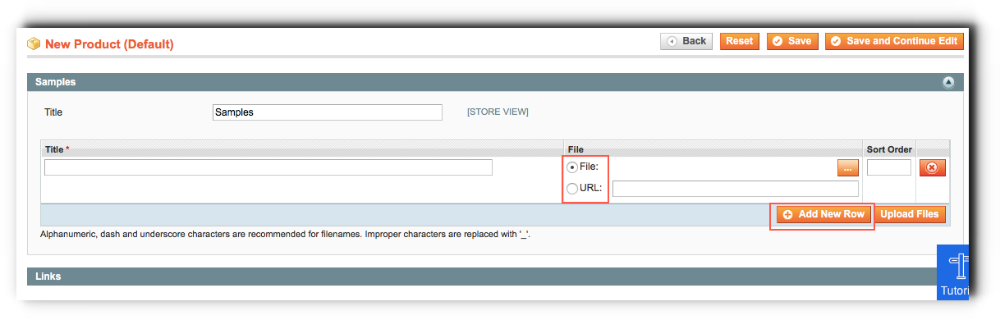 
 
And then, the other part is **Links**. 

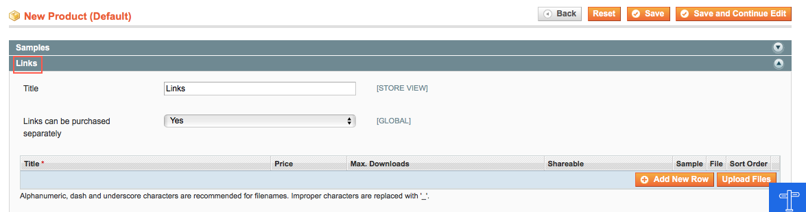 
 
*	Enter the **Title** - to use as a heading for the download links.
*	Enable the function **Links can be purchased separately** by choosing **Yes**. If not, choose **No**
*	Click **Add New Row**, then:

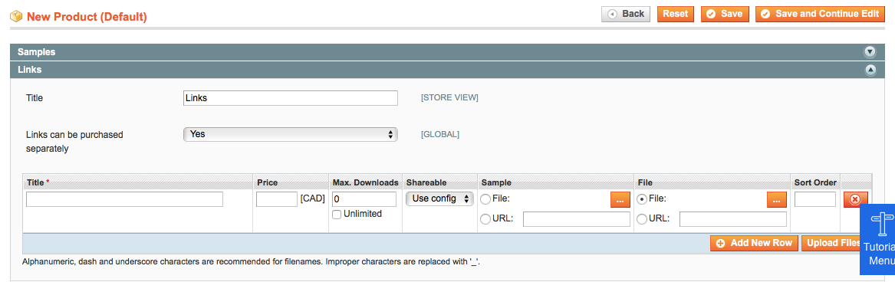 
 
Enter **Title** and **Price**. For both File and Sample files, choose:

*	**Upload File**: To upload the file to the server. Browse the file, and select it for upload.
*	**URL**: To access the distribution file from a URL. Enter the full URL to the download file.

##### Product Setting
###### a. Content

_Path: **Catalog > Manage Product**_

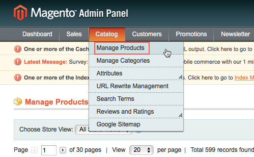 

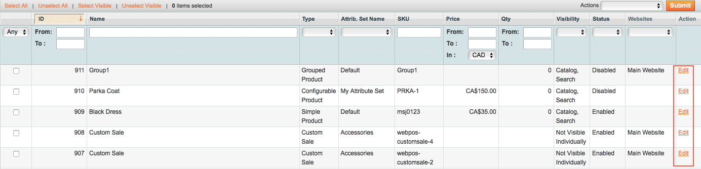 
 
Click **Edit** under **Action** column to edit information of a product. You can quickly enter content into the blank fields or click on **WYSWYG Edit** button to use a more customizable editor tool. 
 
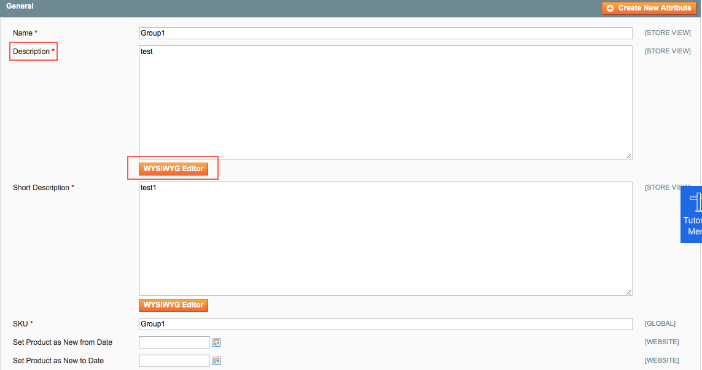  

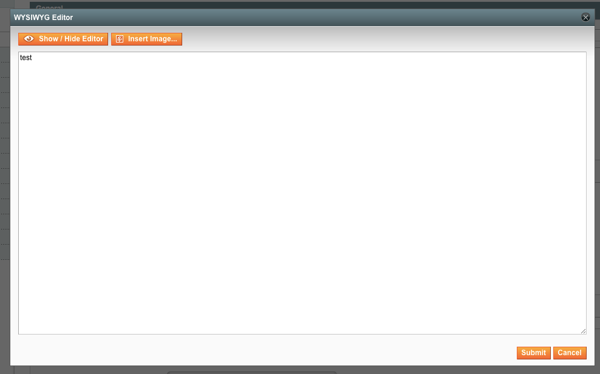 
 

###### b.	Images 
Choose section **Images** on the list of Product Information
 
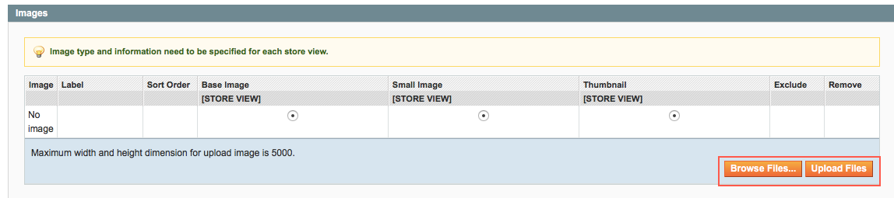 

Tap on **Browser Files** or **Upload Files**  to add images 

###### c.	Search Engine Optimization

This part is in the section **Meta Information** on the **Product Information** menu on the left.
 
  

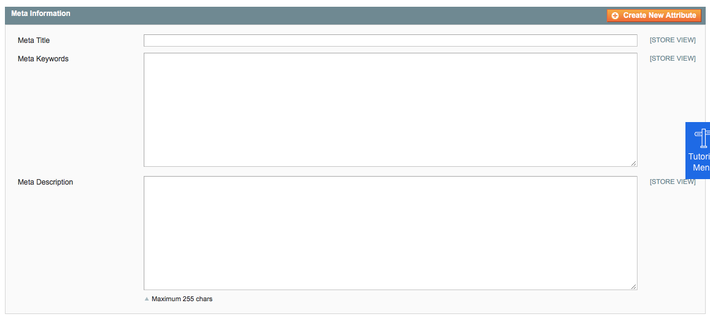 

###### d.	Related Products, Up-sells and Cross-sells 

These 3 sections are on the **Product Information** menu on the left side of the screen. 

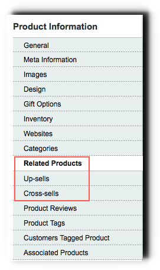 
 
And then, click to add any specific product to one of **Related Products, Up-sells** or **Cross-sells** 

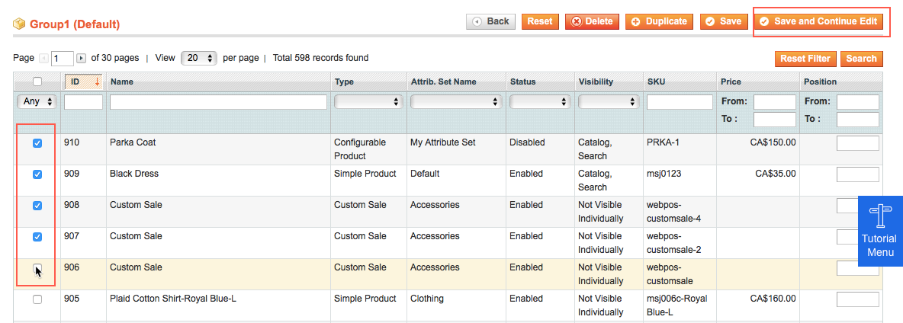 
 
Finally, don’t forget to tap on **Save** button to maintain your adjustment. 

###### e.	Gift Option

_Path: **Catalog > Manage Products > Product Information left** menu **> Gift Options**_

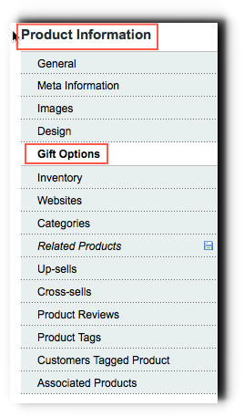 
 
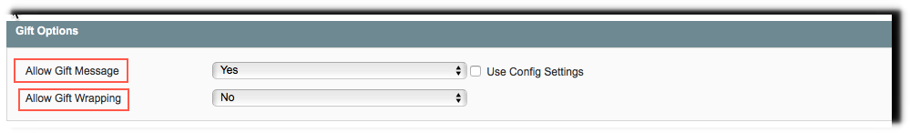 

Users can enable the function of **Allow Gift Massage** or **Allow Gift Wrapping** by choosing **Yes** or **No** option.

### Customer 

_Path: **Customers > Manage customers**_

#### Manage Customer 

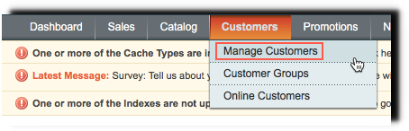 

 
  
1. Click **Add New Customer** to create new customer.
2. Fill out key word to search customer information.

#### Create New Customer 

Click **Add New Customer**.
 
And then the screen will display 2 sections for users to edit: **Account Information** and **Address** 

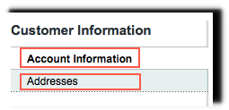
 

##### a.	Account Information section: 

Users need to collect customer information to fill in those fileds. 

 

###### b.	Addresses section: 
 
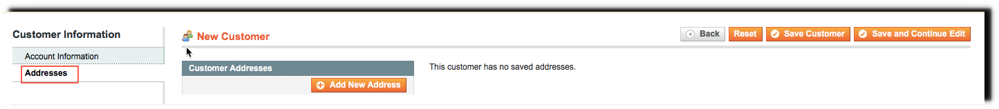

Users could base on the history database or fill in the brand new address for customers.

After fill in all required fields, tap on button **Save** to maintain all changes or adjustments. 

### Warehouse

_Path: **Inventory Management > Stock Listing** section **> Warehouse**_

Please refer to Section <a href="#warehouse">Warehouse</a> for details.

### Location

_Path: **Sales > Web POS** section **> Manage Locations**_

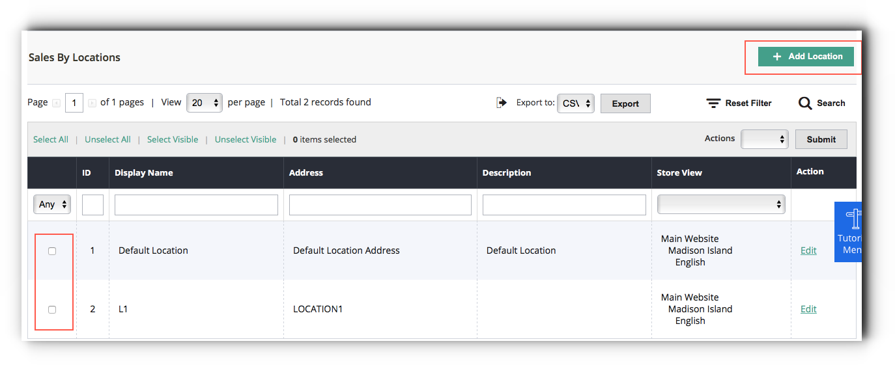
 
To add new location, tap on the green button **Add Location**

A screen allowing customers to fill in general information will be displayed automatically

 
On the pop-up screen:
*	Fill in the **Location Name** (required)
*	Fill in the location **Address** field (required)
*	Fill in the location **Description** field
*	Choose the Warehouse. 
- If you already assign another location to your Primary Warehouse, you won’t be able to assign it again here. 
- If you want to assign a new location to your Primary Warehouse, you need to **Edit** this field of the currently assigned warehouse to **Don’t link to any Warehouses**, then come back to the new location that you wish to assign and assign it to **Primary Warehouse**.

*	Click on **Save**

To edit information for an existing location, tap on the blue underlined **Edit** and then a screen which are as same as the screen above will be displayed.

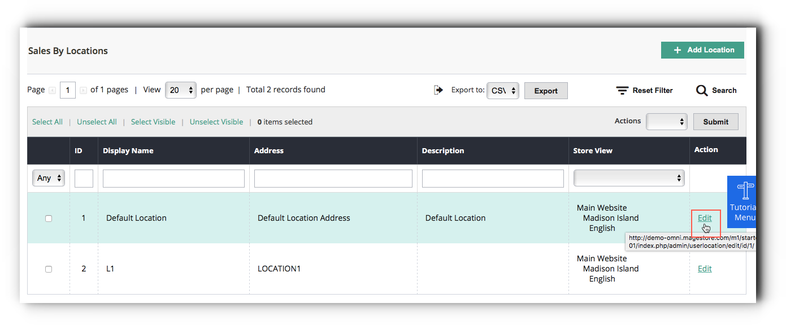
 

### Store (POS) 

_Path: **Sales > Web POS** section **> Manage POS**_

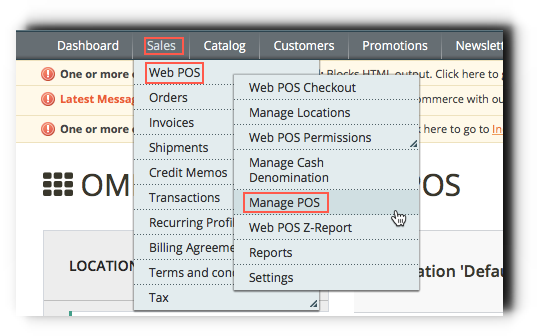
 
#### Create A New Web POS 

Tap on the green button **Add POS** to create new one. 
 
There are 3 parts which are **POS information, Closed Session** and **Currrent Session Detail**. 

In terms of creating new Web POS, users need to fill in section **POS information** only. 

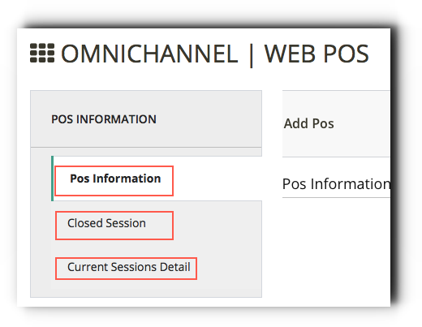

**POS Information tab:**
 
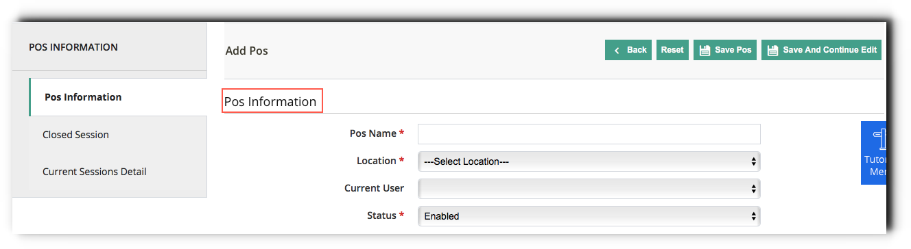

Fill out or select all the re quired fields.

-	**POS Name**: POS’s name. (re quired)

- **Location**: POS’s location. (required). Here, admin can choose the location created and mapped to Warehouse. So that, the admin can control both warehouse and location easily.

-	**Status**: you Enable or Disable this POS

After all, tap **Save POS** to maintain recent adjustment. 

**Note:** Even when you set the warehouse to a certain location, with online store, admin can see clearly warehouse information in any location. HOWEVER, with offline store, only Sales Manager can view the warehouse information only in the mapped location.
IT Admin can give other admin permission to view the Inventory information in any location by going to System > User Roles > Add new role or Edit role > Role Resource

#### Manage Web POS 

_Path: **Sale > Web POS** section **> Manage POS**_

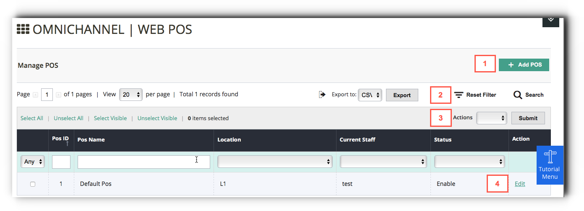
 
1. Click **Add POS** to create new POS.		
2. Click **Filters** to search POS information.
3. If you want to delete a POS, first select a POS, then click **Actions**: choose **Delete**.
4. Click **Edit** to view a POS’s details or edit

## HOW TO USE
### HOW TO USE INSTOCK MANAGEMENT MODULE 
#### Stock listing
##### Stocks in Warehouse

_Path: **Inventory Management > Stock Listing** section **> Stocks in Warehouse**_

Admin can have overview of Stock in the Warehouse and view stock details within the warehouse. These details include **Available Qty, Qty to Ship** and **Total Qty** and **Shelf Location** of each product in the warehouse.

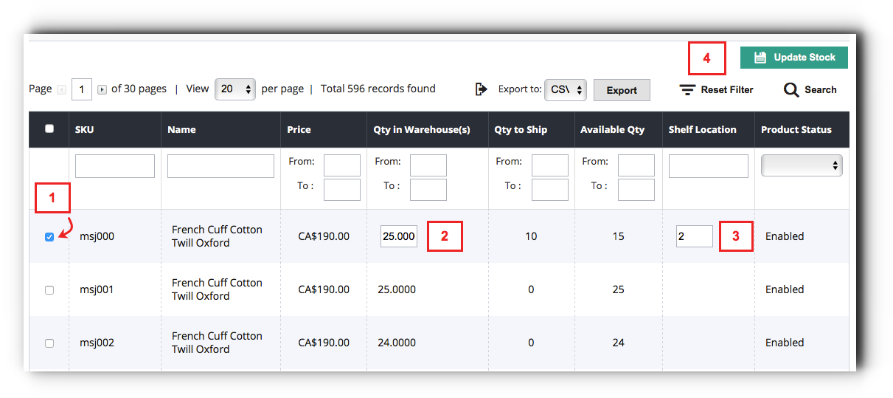
 
You can easily edit Qty of products in-line within a few steps:

1. Mark the checkbox to select products 
2. **Qty in Warehouse(s)**: Edit product quantity in line 
3. **Shelf Location**: Input product location in the physical warehouse 
4. Click on **Update Stock** to save changes

##### Non-Warehouse Products

_Path: **Inventory Management > Stock Listing** section **> Non-Warehouse Products**_

When a product is newly created and not assigned to any warehouse yet, it will be automatically allocated in Non-warehouse. 

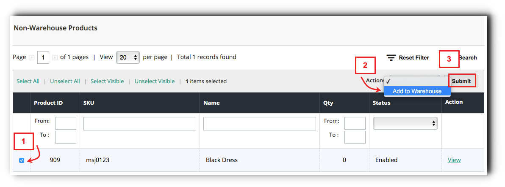

From here admin can: 

1. Select the product by clicking on the checkbox
2. In **Actions** menu, add it into warehouse by clicking on its **Add to Warehouse** from the drop-down list
3. Click **Submit** to confirm and the product is added to the Primary Warehouse

##### Warehouse

_Path: **Inventory Management > Stock Listing** section **> Warehouses**_ 

After installation, the system will automatically provide a **Primary Warehouse**. This warehouse cannot be deleted and can only be edited. All the existing products with stocks level of your website will be automatically allocated in this warehouse.

###### a.	Warehouse information

The **Warehouse** menu allows you to control your warehouse with 6 tabs:

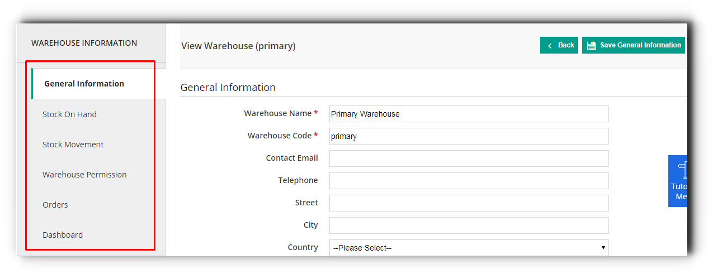
 
1. **General information** about the Warehouse: records basic details of the warehouse such as Name, Code, Contact Email, Address, etc. If you enable the **Link warehouse to Magento front store view** setting above, this is where you can select the warehouse’s linked front store.
2. **Stock On Hand** displays the amount of goods that the warehouse has available at that time. Here, you can update each product’s **Qty in Warehouse(s)** and its **Shelf Location** in-line. Click on Export to transfer the information as an excel file or CSV file to your device.
3. **Stock Movement** shows the changes in stock quantities. Click on each record to view more details. Information includes added/ subtracted quantity, product SKU, movement type, movement date and reference number to access further details by a click.
4. **Warehouse Permissions** manages staff access to the warehouse. Detailed guide is given in the next section **Warehouse permissions**
5. **Orders** records detailed information of each order to the warehouse including status, order ID, purchase date, customer that the order has been billed-to/shipped-to, order value.
6. **Dashboard** demonstrates summarized **sales data** of the warehouse in the last 30 days. You can view data of the warehouse’s sales, best sellers and stock on hand as below.
Manage sales status at a glance with visual charts. You can also print these charts or download with 4 different options of either PNG, JPEG, PDF or SVG vector by opening a menu next to each chart.

 

###### b.	Warehouse permissions

_Path: **Inventory Management > Stock Listing** section **> Warehouse > Warehouse Permissions**_

In this section, Admin can give different warehouse access permissions to different users.

 
1. On the right hand side of the **Warehouse Permission** tab, click on **Assign Staffs** to give different warehouse access permissions.

Then will be a new pop-up screen shown as below:
 
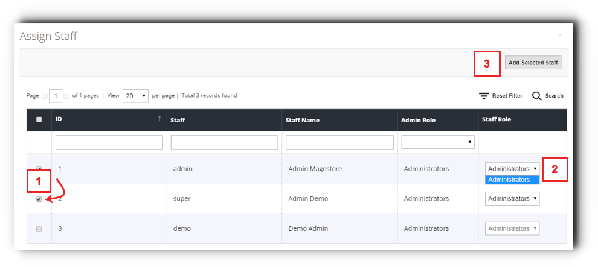 
 
Select Staff users to assign permission

1. Select Staff by marking the checkbox
2. Choose the role from the drop-down list (you can create more roles in Magento core backend). You can assign role to multiple staff at once
3. Click on **Add Selected Staff** button

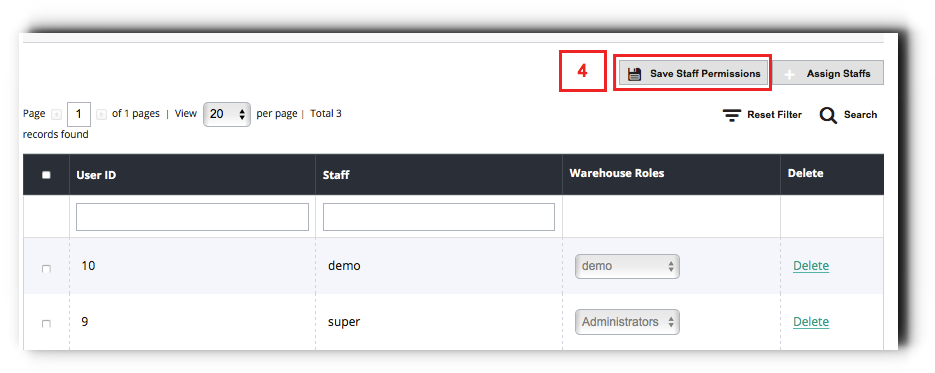

4. Then click on **Save Staff Permissions** to save changes.

#### Stock Control

_Path: **Inventory Management > Stock Control** section_

This module is a powerful assistance to help you keep track of any changes in the existing stock. It combines 6 functions in 1:

* **New Stock Adjustment**: manually adjusts stock quantity;
*	**New Stocktaking**: assists in a complete stocktaking process;
* **Stock Adjustment History**: records details of all stock adjustments;
* **Receipt/Delivery History**: records details of stock receipt/delivery;
* **Stocktaking History**: records details of all stocktaking;
* **Stock Movement History**: records all movements of stock in the warehouses

##### New Stock Adjustment & Stock Adjustment History
###### a.	New Stock Adjustment

_Path:  **Inventory Management > Stock Control** section **> New Stock Adjustment**_
Sometimes your recorded product quantity does not match the actual physical number. Then, this function is exactly what you need to make changes quickly. 

 
Under menu **Stock Control**, you can create New Stock Adjustment in a few steps:

1. **Warehouse**: Name of the warehouse. With this Starter Package, you can only choose Primary Warehouse (also set as default) 
2. **Adjustment Code**: Adjustment code is automatically generated. All adjustments are saved in **Inventory Management > Stock Control** section **> Stock Adjustment History**
3. **Reason**: Fill the reason
4. Then click button **Start** to Adjust

 
From here you have 2 options:

1. **Import products** via CSV file 
2. Select products and input the quantity in line
3. Then you have 3 options to enable your changes:
*	**Save**: temporarily save the adjustment in **Pending** status. You will automatically transferred to the **Stock Adjustment History** page. 
*	**Save and continue to edit**: temporarily save the adjustment in **Pending** status. You continue to stay on a page with your products to continue any further edits. 
*	**Adjust**: immediately activate the quantity changes. Once you hit this button, there is no way to undo it unless you carry out another stock adjustment. The adjustment is marked **Completed** on the **Stock Adjustment History** page.

 
Note that the Qty here can be “Change Qty” or “Adjusted Qty”, depending on how you configure in Store Configuration (please refer to section **Stock Control Configuration**)

###### b.	Stock Adjustment History

_Path: **Inventory Management > Stock Control** section **> Stock Adjustment History**_
 

You can view all records of Stock Adjustments in this page with information including Time created, staff created, warehouse and status. Click on each Adjustment, you can see stock adjustment details. If you click on a **Completed** adjustment, you will be able to export the product list of that specific adjustment by clicking the button **Export**.

##### New Stocktaking & Stocktaking History

Physical Stocktaking acts can be used at any time to double-check and correct inventory discrepancy amounts in Instock Management vs. physical inventory in your warehouses. These consist of:

* A count, in which warehouse staff records the actual number of products in stock at the time of inspection & a manager can rely on it to update inventory in the system later
* Then a confirmation of that count performed by a warehouse manager to officially update the correct number of products in stock (Adjust Stock)
This module will help you carry out a stocktaking successfully to prevent any mismatch between the recorded product quantities and the actual inventory in your physical warehouses.

###### a.	Stocktaking process

_Path: **Inventory Management > Stock Control** section **> New Stocktaking**_ 

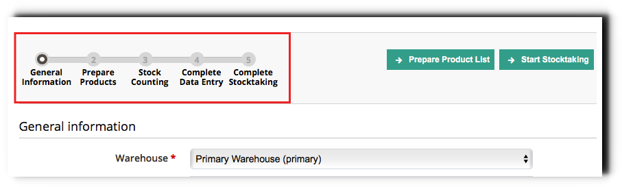
 
There are 5 stages in Stocktaking using Instock Management module:

•	**Stage 1: Fill General information**: After finishing this step, Stocktaking status is **Pending**

 
1. Fill in the reason for stocktaking. You can also fill in the participants and the time of the action but it is optional
2. Choose the products to be stock taken by clicking the **Prepare Product List** button (also means moving on to Stage 2) at the top right of the page. Alternatively, you can skip it to go straight to Stage 3 by clicking the **Start Stocktaking** button

•	**Stage 2: Prepare products before doing stocktake**: Select or import products to prepare before doing stocktake. Stocktaking status will change to **Processing**

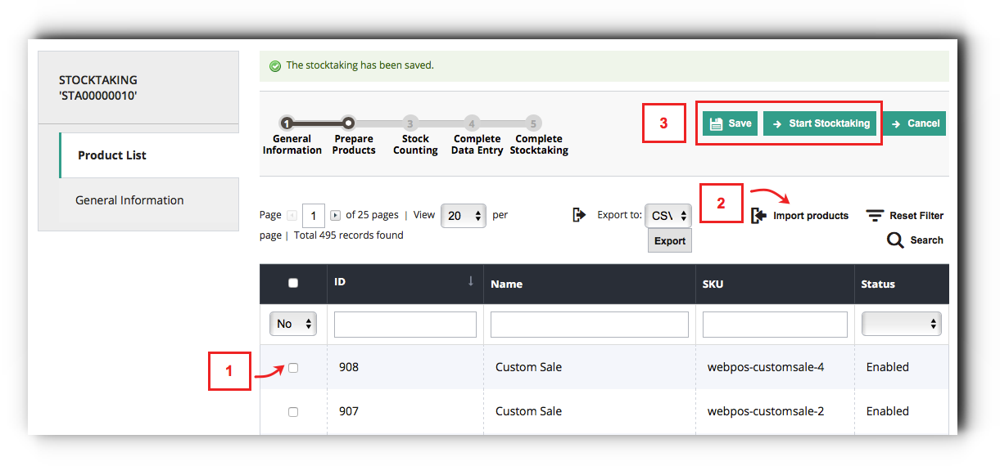
 
1. Mark the checkbox to select the products you want to stock take from the product grid;
2. Alternatively, you can **Import products** using a CSV file (template provided);
3. Click **Save** to stay with your selected products for further edits, or click **Start Stocktaking** to proceed Step 3.

•	**Stage 3: Stock Counting**: Fill in the Qty of product. Now status is changed to **Verified**

1. Select product(s) by marking the checkbox
2. Enter the product quantity that you have recently counted and the reason why there is quantity difference.
3. Either click **Complete Data Entry** to proceed to Stage 4 and have a review of the changes; click **Complete Stocktake** to finish the process; or **Save** to continue editing.

•	**Stage 4: Complete Data Entry**: Save the data that has been stock taken and wait for admin’s approval.

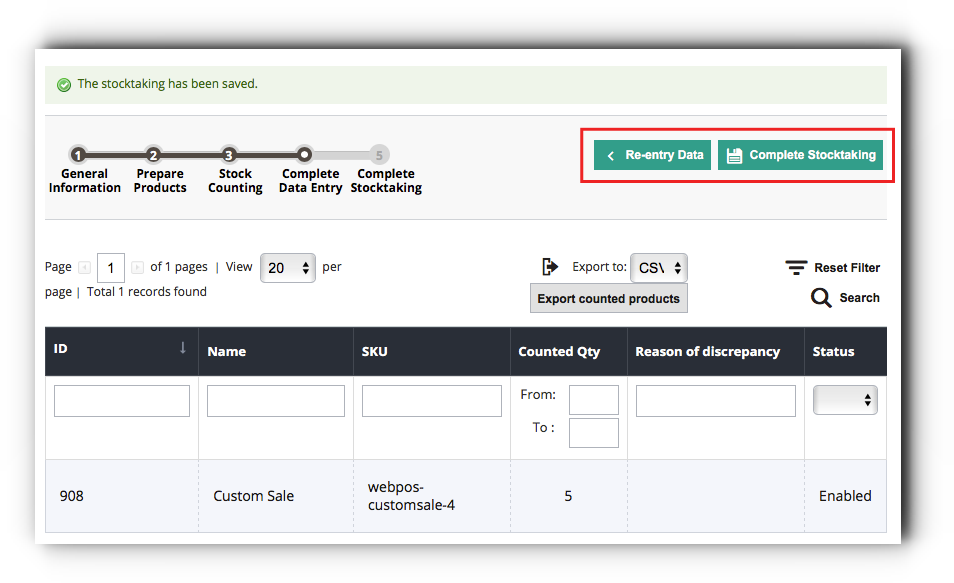
 
This Stage allows you to have a final review of your recent quantity counts. Click either **Re-entry Data** to edit the quantity or **Complete Stocktaking** to move to Stage 5. If you are not an admin, your counting results will be submitted to the admin/ manager for approval before the new quantity is officially updated and the process is marked **Completed**.

•	**Stage 5: Complete Stocktaking**: When admin does this, Stocktaking status will be changed to **Completed**. 

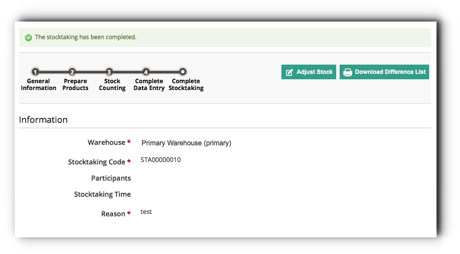
 
This page shows you all details of the stocktaking process including the product quantity before and after the stocktaking process. Similar to Adjust Stock, stocktaking cannot be edited after status is **Completed**. After doing stock take, admin can easily view and export the difference between real stock in the warehouse and the stock level updated by the system. Make a **New Stock Adjustment** by hitting the **Adjust Stock** button or download a CSV copy of the grid using the **Download Difference List**.

###### b.	 Stocktaking History

_Path: **Inventory Management > Stock Control** section **> Stocktaking History**_

1. All Stocktaking details are listed here. Click on each record to view all details of the process. Different status shows to which stage the stocktaking process is done:

* Status **Pending** means Step 1: General Information is done
* Status **Processing** means Step 2: Prepare Products is done
* Status **Verified** means Step 3: Stock Counting is done
* Status **Completed** means the whole stocktaking process is done

2. You can also click on **Add Stocktaking** button to start a new stocktaking process from here.

##### Receipt/Delivery History

_Path: **Inventory Management > Stock Control** section **> Receipt/Delivery History**_

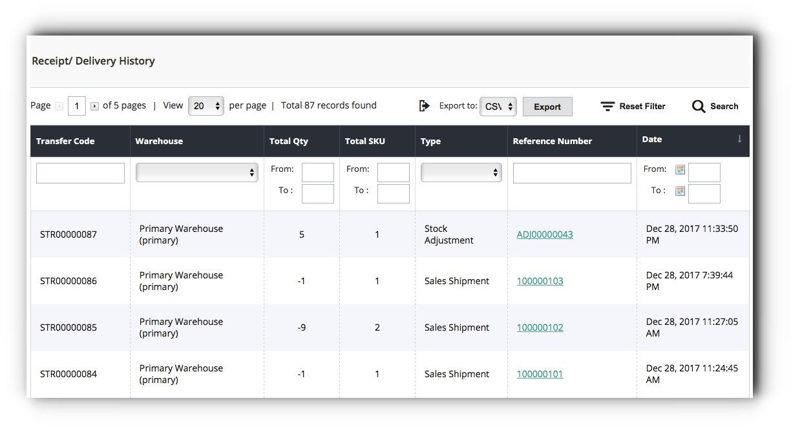
 
This tab provides a record of receipt/delivery stocks in all warehouses. Here you can view Transfer Code, Warehouse, Total Qty, Total SKU, Type (Product status), Reference Number and Date. Click on each record to view all details of the process. You can also click on **Export** button to get file CSV or Excel XML.¬

##### Stock Movement History

_Path: **Inventory Management > Stock Control** section **> Stock Movement History**_ 

The module records all the movements of stocks in warehouse. These movements are reflected in **Stock Movement** report under **Stock Control** submenu.

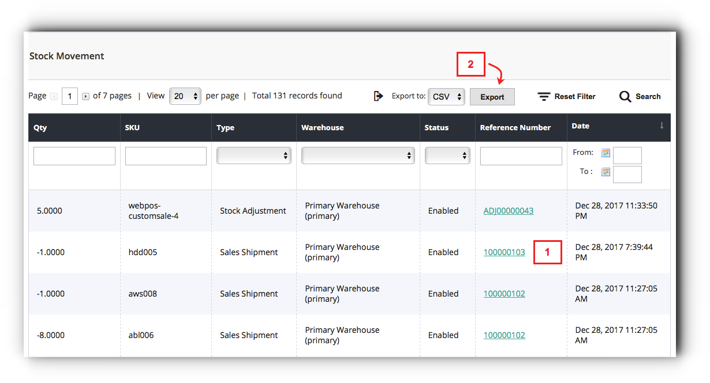
 
1. The table shows SKU of the products added or subtracted from warehouse, the changed  Qty, Warehouse name, Date and Reference number to see the details on a click. 
2. Admin can also easily exports Stock Movement details into CSV or Excel XML.

#### Prediction
##### Supply Needs

_Path: **Inventory Management > Prediction** section **> Supply Needs**_

This feature predicts how many inventory items your warehouse needs for each product within a future period. The system will calculate this number based on your sales history in the corresponding period in the past. 

 
1. **Warehouse(s)**: To process a prediction, select the warehouse (in Inventory Management module, you can only select 01 warehouse i.e. Primary Warehouse) 
2. **Sales Period**: Time range to collect sales data, based on which the system will calculate data for supply need
3. **Forecast Supply Needs Until**: Pick the date that you want to see forecast results.
4. Click **Show Supply Needs** button to finally view the prediction.

The forecast data will be shown in the table as below:
 
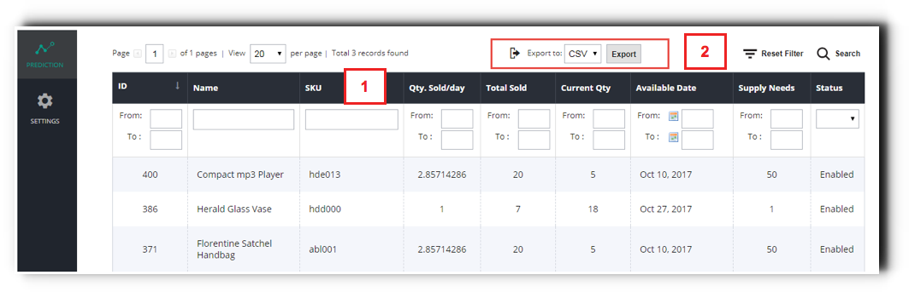

1. The table displays supply needs information as below:
*	**Qty Sold/day**: average quantity sold per day of the product during the chosen sales period 
*	**Total Sold**: total quantity of product that were sold during the chosen sales period
* **Current Qty**: the product quantity that you currently have in the warehouse
* **Availability date**: the system predicts your stock is enough to be sold until this date. After this date, your product is estimated to run out of stock.
* **Supply needs**: the quantity of product that expected to be sold until the time stamp you set. 
* **Status of products**: whether the product is enabled to be sold

2. The Supply Need Forecast can be exported to CSV or XML file by hitting **Export** button.  To start another prediction, you may edit criteria for supply forecasting and hit **Show Supply Needs** again to refresh the prediction result.

##### Low Stock Rules

_Path: **Inventory Management > Prediction** section **> Low Stock Rules**_

**Note**: **Low Stock Alert**  is when a type of product is on the verge of low-stock, Low Stock Alert will alert the Inventory manager to import more items. This feature avoids lack of items to supply for stores. 

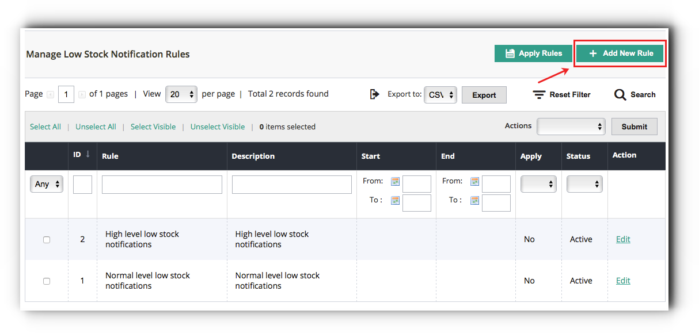
 
Select an existing rule to edit or click **Add New Rule** button at top right of the page. Admin can create unlimited rules to notify low stock status. One rule contains: **Rule Information, Conditions & Action**. There is no limitation in the quantity of rules set.

###### a.	Rule Information tab
 
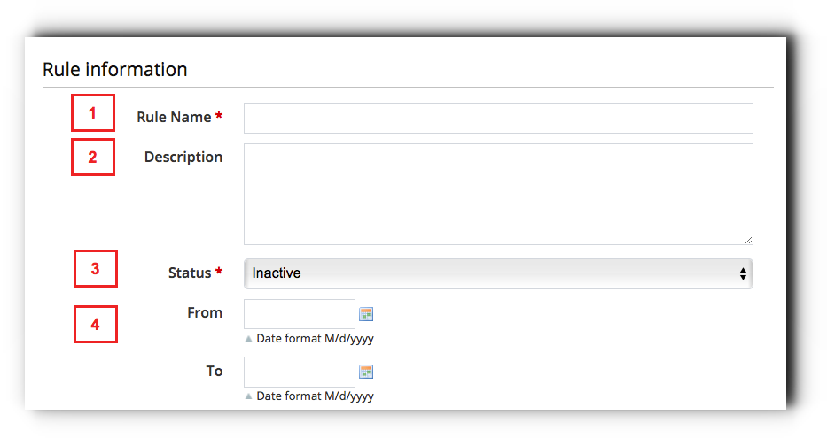

1. **Rule name**: Enter the low stock rule name
2. **Description**: Add a brief about the rule (optional)
3. **Status**: Select **Active** to enable the rule
4. Use **Calendar** to choose From and To date for a term of validity (optional)
 

5. Select an **update time**: either daily or monthly. The system periodically check stock availability and automatically send email notifications admin and warehouse managers. 
6. Select hours the notification message will be sent

###### b.	Conditions tab

This tab allows you to set up Product Conditions & Low Stock Condition.

•	**Product Conditions**

In the **Product Conditions** section, you can set the limitation for applying rules. 

 

•	**Low Stock Conditions**
There are 2 types of low stock rule: 

 
•	**Type 1: Available Qty.**: you can select Qty. threshold that the system will notify to import. 

1. Select **Available Qty.**
2. Set the number of **Threshold (quantity)**
3. Select **Both Warehouse and Global** for **Notification Scope**
4. Select **Warehouse(s)** for those rules will be applied
 
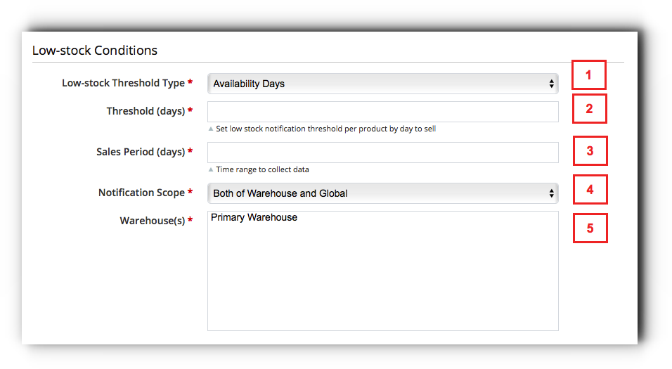
 
•	**Type 2: Availability Days**: you can select Day Threshold that system can notify you to import items. You do not need to enter the Qty. here because the system will automatically calculate the selling rate based on the sale period you provided and the real Qty. in your warehouse and (store)

1. Select **Availability Days**
2. Set the number of **Threshold (days)**
3. Set the number of **Sales Period (days)**
4. Select **Both Warehouse and Global** for **Notification Scope**
5. Select **Warehouse(s)** for those rules will be applied

###### c.	Actions tab

You confirm who will receive the low stock notification by

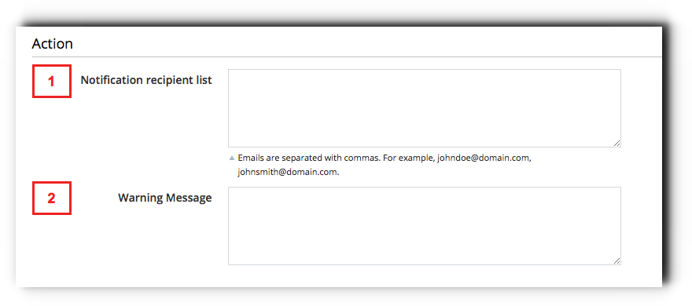
 
1. **Notification recipient list**: Enter email address  to send the low stock notifications to
2. Enter content of the **Warning Message**
 

Then, you can choose: 
•	**Save and Continue Edit**: to save the process and continue edit on the current page. 
•	**Save and Apply**: you can apply rule immediately
•	**Save Rule**: you can save the rule but it will not be applied, in case you need to ask for permission before applying or double-check with other people. 

**Note:** You can edit the rule that you **Save and Apply** or **Save** by going to **Inventory Management > Prediction** section **> Low Stock Rules >** clicking on **Edit**

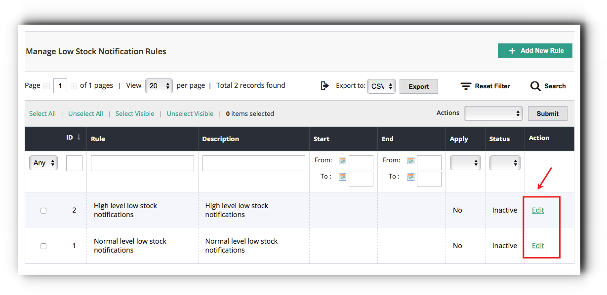
 
##### Low Stock Notifications

_Path:  **Inventory Management > Prediction** section **> Low Stock Notifications**_

**Low Stock Notifications** displays warning messages about the products which are nearly out of stock in warehouses. It shows all notifications with information including Sent at, Update Type, Email received, Recipients and Action. Click **View** action on each notification log to see details of products that have been low stock including Name, SKU, Image, Qty Notified and Time Notified.

### HOW TO USE WEB POS
#### Log In and Manage Account
##### Log in

Go to WebPOS frontend and fill in required Username & Password and click **Login** to log in. (you can also access WebPOS frontend from backend, by following path: **Sales > Web POS** section **> POS Checkout**)

 
After clicking **LOGIN** button, users must choose a Location and POS to continue

 

##### Manage Account
To manage account, user follow this path: from top left menu icon **> Settings** section **> Account**

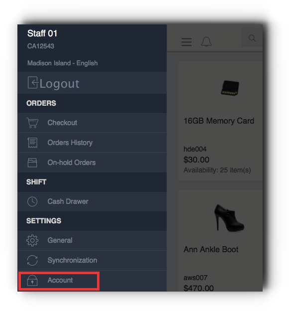

Then, users could view, edit or upgrade account’s information and password

 
1. **Display name**: The name of user account 
2. **Current Password**: The password is being used 
3. **New Password**: Fill in those field if users want to change password 
4. **Confirm**: Retype the new password 

Finally, don’t forget to click on **Save** to apply your changes to the system. 

To reload and/or update data, follow path: from top left menu icon **> Settings** section **> Synchronization** and click **Update/ Reload** as you wish.

 

##### Manage Settings

_Path: from **WebPOS frontend**, click on top left menu icon **> Settings** section **> General**_

There are 3 tabs to manage:

###### a.	Checkout tab

 
1. **Use Online mode**: Online mode allows real-time synchronization between Magento backend and POS, while offline mode operates faster and allows normal checkout even then the internet connection is out.
2. **Auto check the promotion rules on checkout: (Offline mode)** allows automatic checking in offline mode

###### b.	Catalog tab
To allow POS to display out-of-stock products: in WebPOS frontend, go to **Settings > General** section **> Catalog**

**Note**: this function’s available for online-mode only

 
Choose **Yes** option to enable **Display out-of-stock product in search result**. When customer searches for a product that is out of stock, the product still shows up but with an **Out of stock** icon on the top right of the product thumbnail.

###### c.	Currency tab: 

This tab allows changing to another currency that is preset in backend settings. Note that all previous orders will be removed from **Order History** after you change currency.

#### Manage Session
##### Create Session

When staffs started their shift, POS will open a session for them to create **Opening Balance** (the amount of cash at that time). 

Those numbers will be saved in the system, so POS could provide admin detailed statistics of cash flow in stores. 

Particularly, when staffs logged in to any POS, a window of **Opening Session** will appear automatically. 

 
1. **Staff**: Display the name of the staff in this session 
2. **POS**: the location of POS 
3. **Cross icon**: Click on it to add more money value when opening session
4. **Coin/Bill Value**: Value of the currency contrbuting to Opening Balance (for example: $10)
5. **Number of Coins/Bills**: the quantity of the currency unit (for example: 2) 
6. **Subtotal**: System will automate calculate the amount of money based on the Coins/Bill Value and Number of Coins/Bill (for example: $10 x 2 = $20, so the subtotal will display number $20)

After filling all those fields, click **Open Session** button to finish this process successfully or you can click on **Cancel** to exit. 

**NOTE:** Configure to Open Session Automatically

In case you logged in but no window of Open Session appeared, you can configure it in backend easily by following this path: **Sales > Web POS** section **> Settings > General Configuration**

Find the **Need to create session before working** setting and choose **Yes** to activate the function which is automatically creating new session when staffs change their shift for each other. 

##### Manage Session

_Path: from top left menu icon **> Session Management** section **> Session Management**_

**NOTE**: You need to enable **Need to create session before working setting** in backend (path: from **backend > Sales > Web POS** section **> Settings > General Configuration**) to see this section. 

 
Then, your screen will be displayed like the picture below: 

 
1. **Staff**: The name of staff in this session 
2. **POS**: Location of POS 
3. **Date and Time** when opening this session 
4. **Opening Balance**: the amount of cash in cash drawer at the beginning of the session 
5. Theoretical Closing Balance: = Opening Balance + Manually Input Amount of Put Money In/Take Money Out + Total sales (**in cash only**)
6. **Real Closing Balance**: the real amount of cash in cash drawer at the end of the session
7. **Difference** between  **Theoretical Closing Balance** and **Real Closing Balance**
8. & 9. **Put Money In/ Take Money Out**: during an opened session, cashier can manually input of cash in/out in the session. Detailed instruction is in the next section.
10. **Set Closing Balance**: before ending a session, staff need to set the final cash amount in the cash drawer. 
Other elements displayed in this window also include:
•	Manually input of cash in/out in the session and transactions in cash are recorded in the **+ Transactions/ - Transactions** links.
•	Total Sales by all Payment Methods
•	Cashier can Print the session details by clicking on the **Print** button
•	End the current session by clicking on **End of Session** button. For detailed instruction of End Session, please go to **End Session**.

##### Record Cash In/ Cash Out

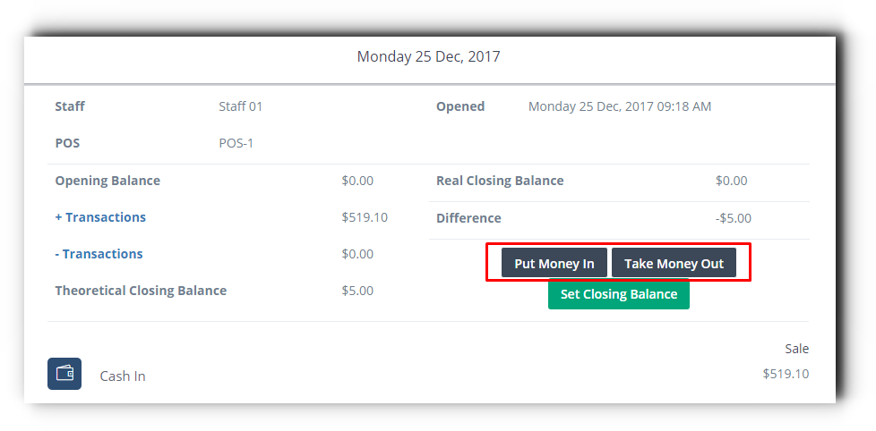
 
During an opened session, cashier can add extra cash in/out of the cash drawer by clicking on **Put Money In/ Take Money Out** buttons in the **Session** window.

* **Put Money In**

1. Amount of cash that staff will put in the drawer (**must be greater than 0**)
2. Reason for putting cash in
3. Click **Done** to save changes

*	**Take Money Out**

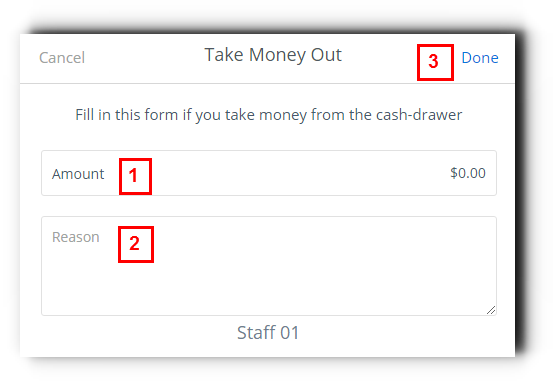
  
1. Amount of cash that staff will take out of the drawer (**must be greater than 0**)
2. Reason for taking cash out
3. Click **Done** to save changes

##### End Session

Finally, at the end of the day, POS Managers must undertake mission to create Closing Balance, which means they have to confirm the amount of cash in store after all transactions on that day. Then, the system would be able to provide Session Report for Manager.

**NOTE**: Before setting Closing Balance, you must set Cash Denomination in backend first.

_Path: **Sales > Web POS** section **> Manage Cash Denomination**_

 
Click on **Add Cash Denomination** button and enter the information in the new window including the denomination name, value and sort order (this sort order acts as an alternative way to organize these cash denomination besides ID). Then, click on **Save Cash Denomination** or **Save and Continue Edit** to save your changes.

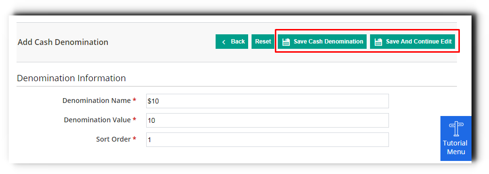
 
After filling enough Cash Denomination information, you can set **Closing Balance** and continue ending session.

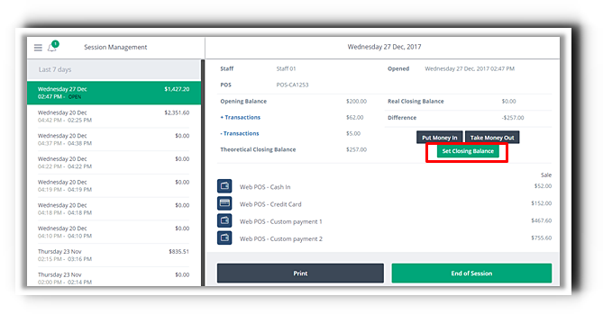
 
To close the session, you need to first **Set Closing Balance** to record Real Closing Balance in cash drawer by filling the value of coin/bill and the number of each coin/bill value in the form below, then click **Confirm** 

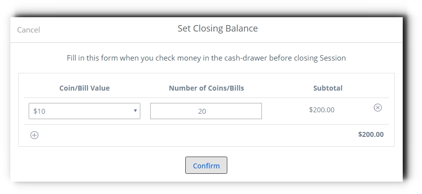
  
2 situations could happen in this step:

* If the Theoretical and Real Balances are the same, you will go back to the Session window, click on **Validate Closing** to finish closing the session.

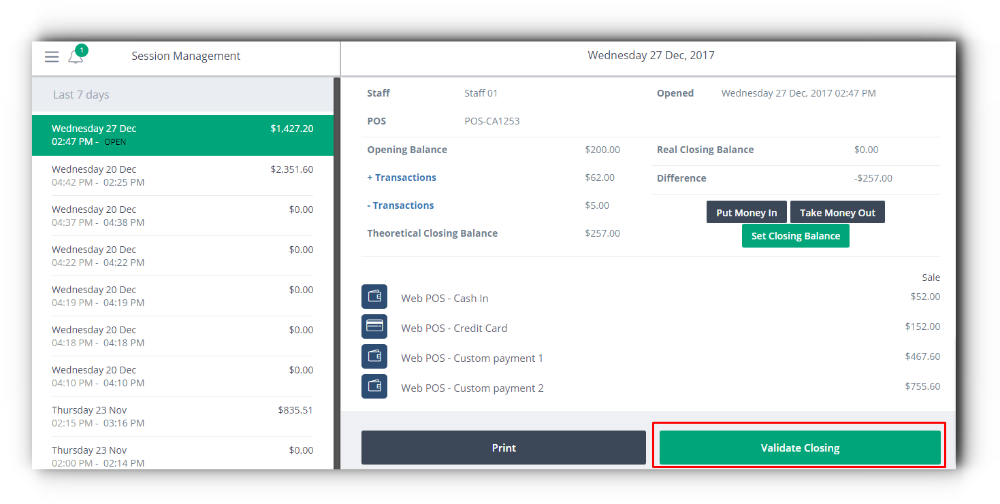
 
*	If the Theory and Real Balance are not the same, the system will display a notification as below:

 
You can click **Cancel** and re-entry the closing balance, OR accept the difference by clicking **OK**

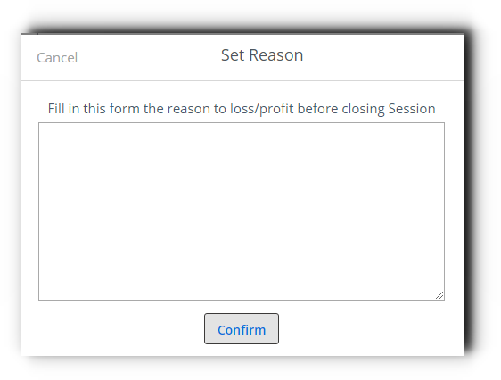
  
You can fill in the reason for the difference (if you want to) and hit **Confirm**. Then you will be directed back to the Session page, click **Validate Closing** button to finish closing session.

#### How To Do Transactions 
##### Filter and Search Products Quickly
###### a.	Configure Searching Product 

**NOTE**: Only products with turned on **Visible on Webpos** setting (screenshot below) can be found on WebPOS frontend.

 
To allow POS to display out-of-stock products: in WebPOS frontend, you have to follow this path: 

_Path: **Setting** tab **> General > Catalog**_
 
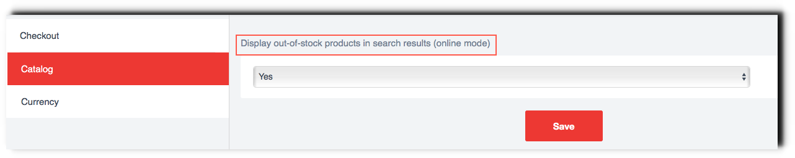

To activate this function, you have to choose **Yes**. 

**NOTE**: Please note that this function is only available when you’re in online mode 

###### b.	Search Product in Frontend  
There are 3 ways in which you could search products: 
*	Using Categories
*	Using Product Attributes
*	Using Barcode 

**Using Categories**

Click on **All Categories** to search products in system. Select the corresponding categories as you prefer

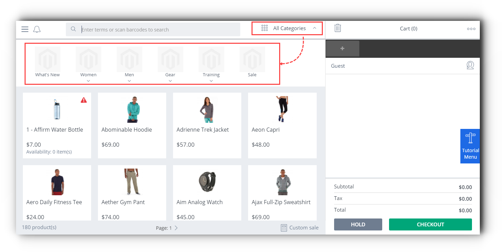

**Using Product Attributes** 

To search by product attributes, enter your keyword into the Search bar and matching products will be displayed right away.
 
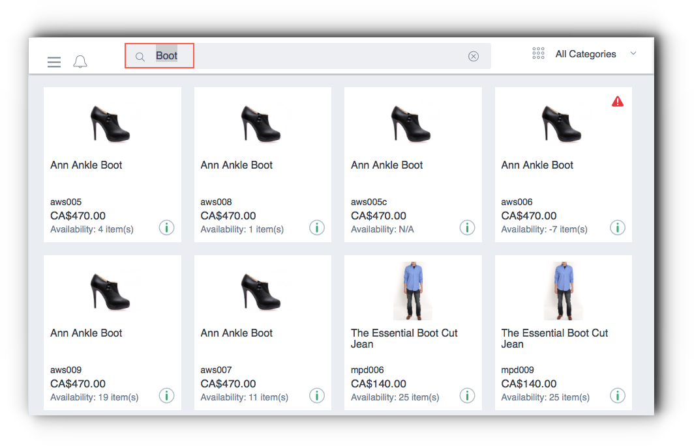

**Using Barcode** 

* Connect Web POS with barcode reader devices (Please refer to **How Web POS works with peripheral devices**)
* Scan barcode and then the barcode attribute will be filled automatically in the search box
* The matching product will be shown in the list.

##### Add Products to Cart and Edit Cart

###### a.	Add Products to Cart 

* With single product, you just touch them on screen to add to cart 
* With configurable, bunde, grouped products, after clicking, you are able to adjust the quantity before adding them to cart

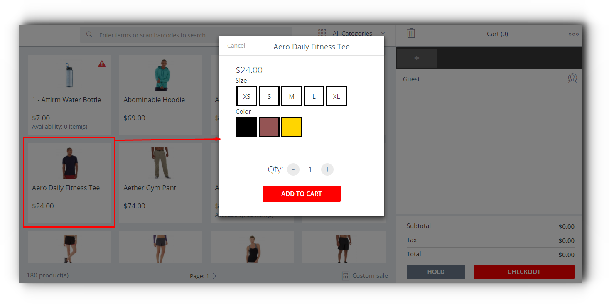
 
###### b.	Edit Products in Cart 

After adding products to cart, you can edit the quantity of each product by clicking on the product that needs editing. A popup will display with option to edit **Qty**. To edit Qty., just enter a wanted number or click on +/-. The number of products will be adjusted in the cart right away.
 

###### c.	Remove Products from Cart

To remove products in cart one by one, click on **x** button of the corresponding product. After that, the cart will be updated immediately. Or you can click on the waste basket icon to clear cart.
 
 

##### Add a Custom Sale Item to Cart 

Custom sale item is a item that Web POS user creates when checkout. It is used when the product hasn’t been added to the system or Web POS user cannot find it in the product list.
To create custom sale: Tap on the **Custom Sale** button at the bottom of POS screen 

 
 
Then it will pop up a window for users to configure this custom product:

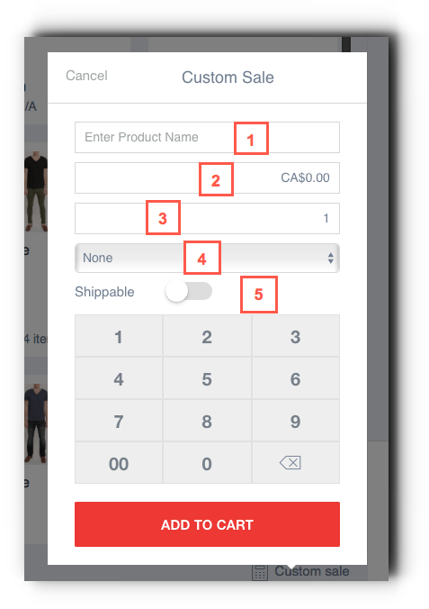
 
1. **Product name**: Enter the name of products manually
2. **Price of Products**: Enter the price manually or use the calculator below
3. **Quantity of Products**: Enter the quantity you want to add to cart
4. **None/Taxable Goods**: Choose whether product is taxable or not 
5. **Shippable**: Choose whether products will be shipped or not 

Finally, don’t forget to tap **Add to Cart** to finish the process successfully.

#### Apply Coupon Code or Discount to Cart 
##### Apply Coupon Code or Card Discount 

Here is the tutorial to apply Coupon Code/ Discount that you created with Magento’s functions **Catalog Price Rule** and **Cart Price Rules**

If you want to apply custom discount manually to a product, instead of applying for the whole cart, please refer to Section **Apply Custom Price or Custom Discount to a Product** 

To use this function, click **Add Discount**

 
Then you can choose to apply a Discount amount or Promotion code 

* **To apply discount to cart:**

 
1. **Name**: Enter a name for this account, so you can check it easily again
2. **Amount**: The value of discount that you apply for cart. It can be calculated by cash or by percentage 
3. **Discount type**: choose between percentage or fixed discount

Tap on **Apply** to finish this process succesfully 

*	**To apply coupon code to cart:**
 
Just fill in available coupon you want to offer for your customers. The cart will be updated automatically after you click on **Apply** button.

(Users can also check this code rules before applying it by clicking on **Check**)

##### Apply Custom Discount or Custom Price to a Product

Here you can manually add a custom discount for a product (either by a fixed value or percentage) instead of the whole shopping cart. If you want to apply a preset discount code, please refer to the previous section **How to Apply Coupon Code or  Discount**.

After adding products to cart, besides editing the quantity of each product (refer to section **Edit products in cart** for more details), you can click on the product to edit other information. A popup will display with edit option for **Custom Price, Discount**. Remember that you can only change information by Custom Price **OR** Discount, instead of both at once for a product.

###### a.	Apply Custom Price

 
You can set custom price for products by clicking on **Custom Price** button. The next popup will be shown as below:

 
In this popup, please choose type you want to adjust for the price, either by a fixed number or percentage.

* If you adjust price by a fixed number, the checkout price will be the value you enter. 
* If you adjust price by percentage, the price will be the result after multiplying the discount percentage rate by the original price. 
Then, products in cart will be automatically updated with the price you enter.

###### b.	Apply Discount

You can also apply Discount to a single product as you do to cart.

Editing discount for each product is similar to edit by Custom Price. Click on **Discount** button and choose types of discount–fixed discount or percentage–you want to adjust:

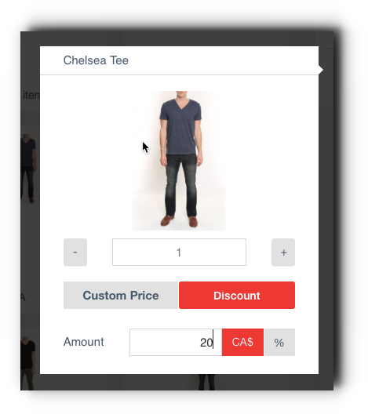
 
* If you edit discount by fixed number, the price will decrease by the exact value you have entered
* If you edit by percentage, the price will decrease by the percent you have entered (it is similar to Custom Price by percentage).
Then, the product price will be updated in the cart.

#### Checkout Process
##### Handle Customer Information At Checkout 

After putting products into cart, staffs have to check out for customers. There are 2 options for them to select. The first one is **Customer Checkout** and the other is **Guest Checkout**.

Tap on the Customer icon on the right side of the screen to use **Customer Checkout** and **Guest Checkout**.
 

###### a.	Add a New Customer

Add customer by clicking on **Customer icon** on the right corner. You will see a screen as below:

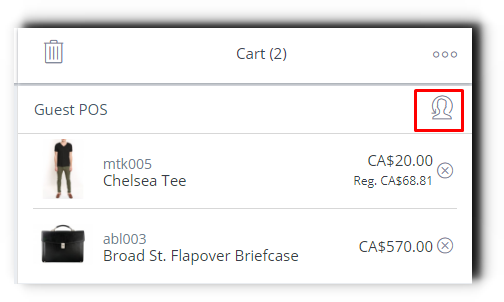

 
For customers who shopped at your store for the first time, staffs could create a new customer by tapping this **Create Customer** button

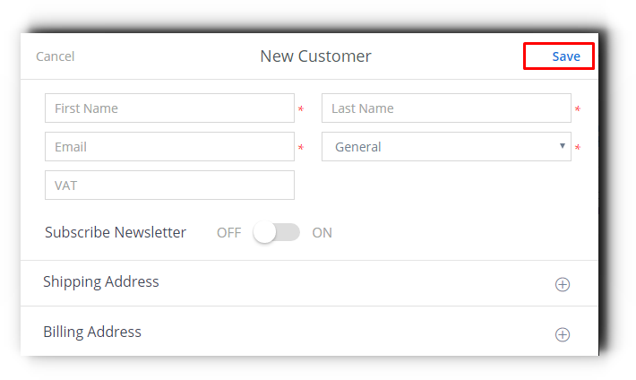

Fill in all those field to create customer database 

Finally, don’t forget to tap **Save** to maintain new data on POS system, then staffs could recall for the next time customer shopping

###### d.	Search an Existing Customer
 
For customers who once shopped at your store, staffs could find out their customer data saved on POS by searching by name/email/phone in the Search bar; or select the customer from the recent customer suggestions down below:

###### e.	Guest Checkout

Or by other ways, staffs could also use Guest Checkout for customers. 

 
When you use Guest Checkout, the default customer information that you configure in backend will be used (Please go to the section **Default Guest Checkout** for more details). At checkout, all fields will be auto-filled with that default information.

 
##### Add Order Note 

Click on the icon on the top right corner and choose **Add Order Note**. In the **Order Comment** box, type the content that reminds you of this order. Then, save it.

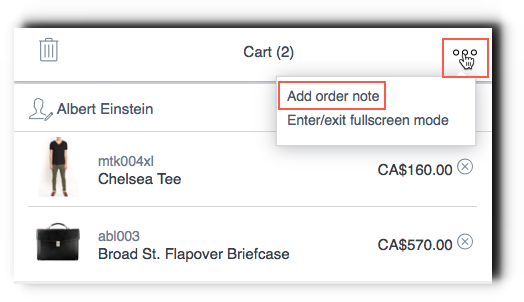

##### Check Order Comment 
###### a.	In Web POS Screen

_Path: **Orders > Orders History or Orders > On-hold Orders**_

To view comment of order, you can go to **Orders** tab in Web POS screen, choose an order then scroll down to see **Comment History**.
 

###### b.	In Magento Backend

Users could also check Order comment in Magento Backend 

_Path: **Sales > Orders >** Click on specific order **> Comment History**_

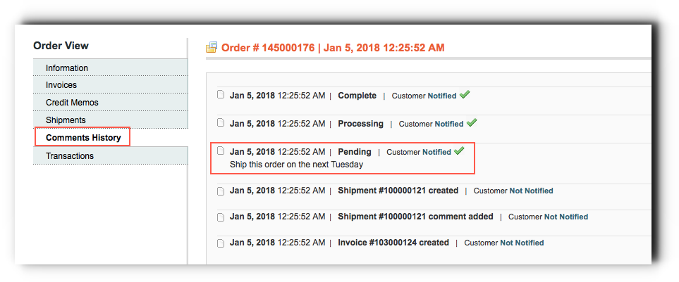 

##### Process At Checkout For Customer

After customers already picked their products, staffs need to help them checkout by tapping on the **Checkout** button at the bottom of the screen. 

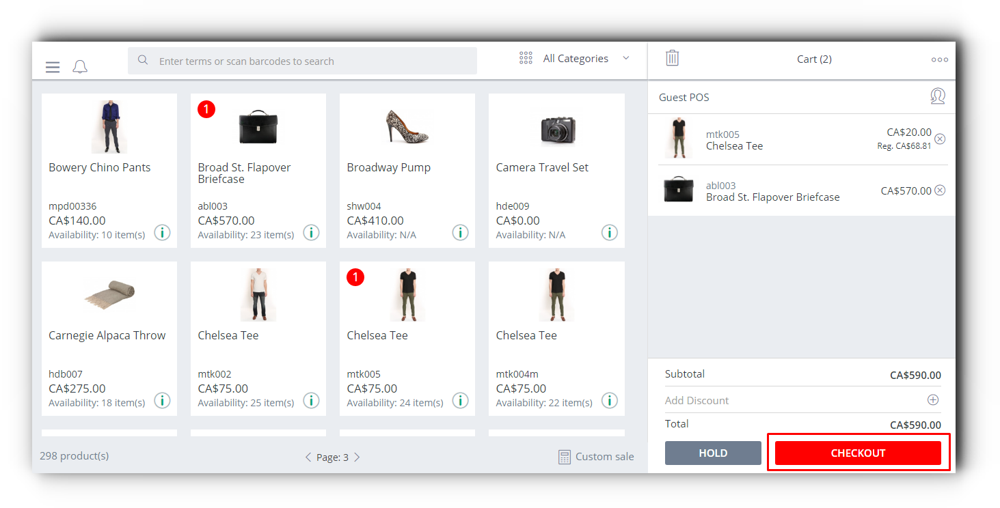
 
Then, in the next step of checkout process, choose payment and shipping method 

**NOTE**: Please refer to **Enable Payment Method** and **Set up Shipping Method** for further details about payment and shipping method configuration for WebPOS

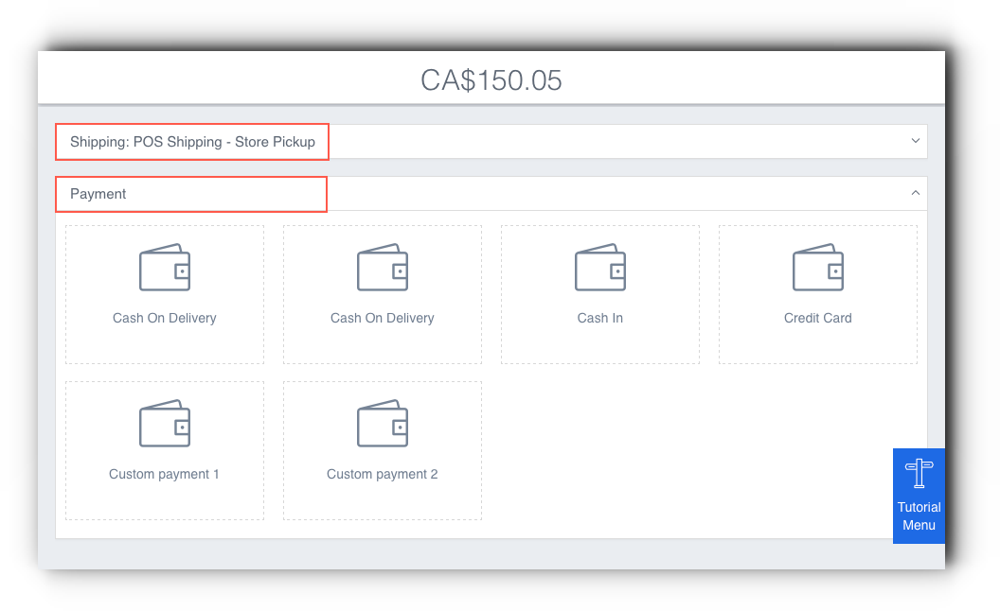
 
* **To choose Shipping Method:** 
There are several options for customers such as: **Flat Rate (Fixed Rate), Store Pickup or Custom Method** (the method which your store can customize in backend to fit the need of your own) 

 
*	**To choose Payment Method:** 
Staffs can choose among several methods such as: **Cash On Delivery, Cash In, Credit Card, Custom Payment 1 or Custom Payment 2**

 
* **Credit Card**: Magestore Web POS supports Authorize.net & Stripe. Sale staff can fill in card information manually or swipe card (if the POS system is connected with a card swiper). For more information, please go to section **How Web POS works with Peripheral Device**

* **Split & Partial Payment**: For more information about Split Payment, please go to section **Split Payment With Web POS** and **Partial Payment With Web POS**

##### Split Payment With Web POS 

Customers are allowed to choose more than 1 payment method. 

For example: The value of bill is $390, customer can pay $40 in cash and the remain ($350 would be paid by credit card). 

Here is the step by step instruction for staffs to help customers checkout when they want to use more than one payment method 
 

 
* **Step 1**: $40 pay In Cash: Tap on **Cash in** on checkout screen, enter the value paid as $40 

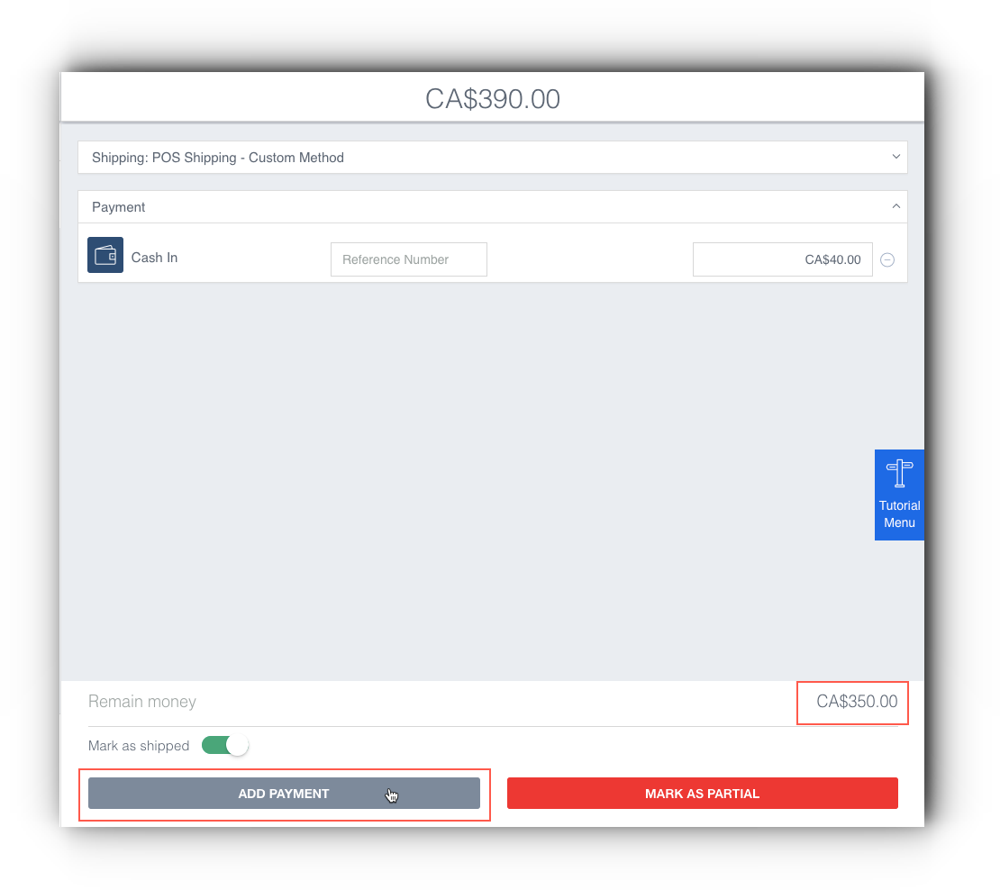
 
* **Step 2**: The remaining ($350) is paid by Credit Card: Tap on the button **Add Payment**, then choose **Credit Card**
 

POS system will process like the screenshot below:

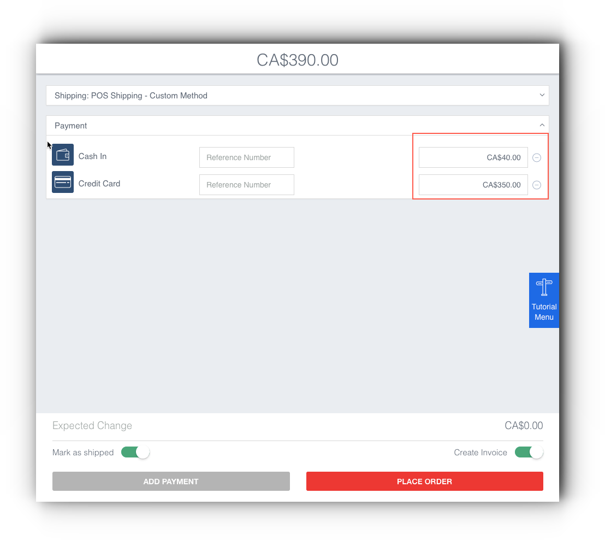
 
At the end, don’t forget tapping the button **Place Order** to finish this process 

##### Partial Payment With Web POS 

Besides Split Payment feature (please refer to **Split Payment with Web POS**), our solution also allows customers to pay partially at the time of checkout and pay the rest later. 

For example: the value of bill is $390. Customer want to pay first $350 and the remain ($40) will be paid later. 

* **Step 1**: Pay $350 firstly. Assuming this customer want to pay $350 by Credit Card, then tap on **Credit Card** and then adjust the value from $390 (full bill) to $350. 

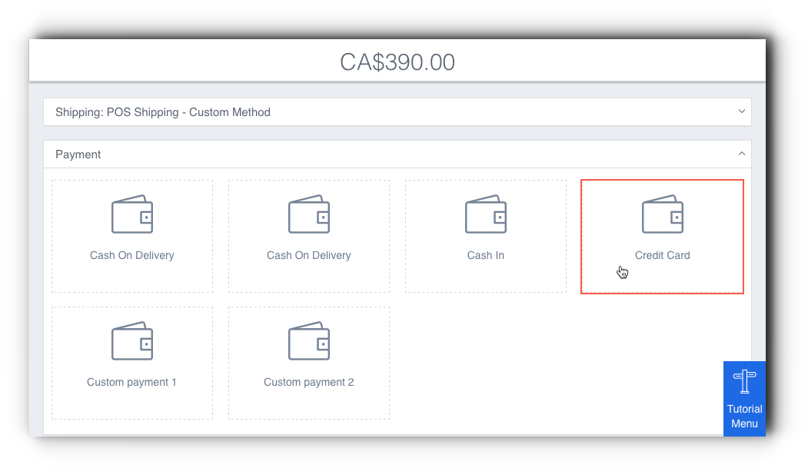
 
* **Step 2**: Mark the bill as Partial Payment by tapping on the button at the bottom of the screen **Mark as Partial**

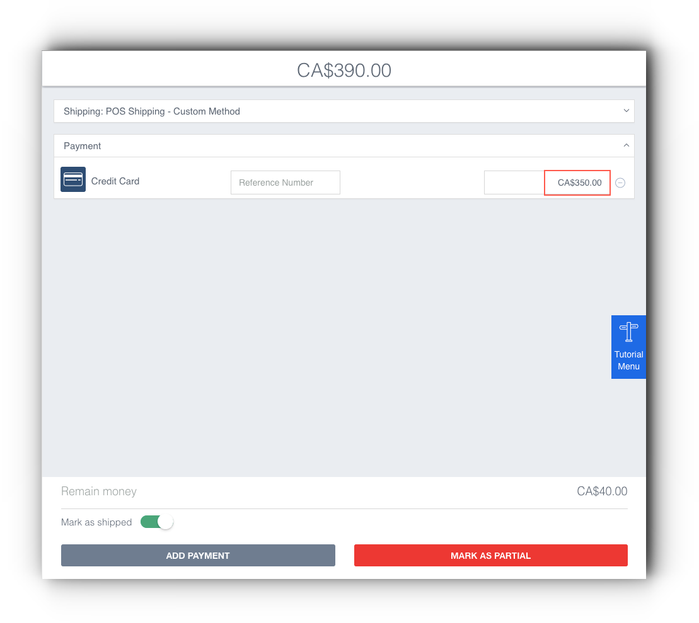
 
A message will be displayed to inform you of the successful process:

 

* **Step 3**: Customer came back and pay the rest of the bill 

_Path: **Web POS Frontend top left menu > Order** tab **> Orders History**_

The order which has partial payment will be labelled as **Pending** order

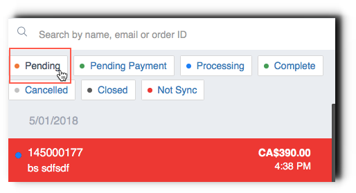
 
Tap on **Pending** label and all the Partial Payment Order will be listed out. 

Staff can recall order when customer came back by choose one order in the list 

Afterwards, details of the order will be displayed on POS screen. Tap the button **Take payment** on the right side of the screen to process the rest payment from customers. 

 
We continue the example above, now, customer comes back and pays $40. Let’s assume that he/she pays in cash. Tap on **Cash in** and the system automatically display the remaining amount which customer has to pay. 

 
Finally, don’t forget to tap button **Submit** to finish this process and complete this order.

##### Keep Orders On Hold For Further Processing 

Your customers cannot make up their mind yet while other customers are so hurry to pick up their orders. As a seller, you don’t want to lose potential customers. Therefore, POS has a prominent feature letting you hold orders in no limit in time. It means that you can hang up the lastest order and create a new one at the same time.

###### a.	Put Order on Hold 
After adding products to cart, you can hold this order by tapping the button **Hold** at the bottom of the screen 

 

###### b.	Check on-hold Orders

*	**On WebPOS Frontend**

_Path: **WebPOS frontend top left menu > Orders** section **> On-hold Orders**_

To check orders that have been put on hold, select **On-hold Orders** section. You may select **Checkout** whenever customer is willing to take final action for payment or you may **Delete** it if it is not effective anymore.
 
 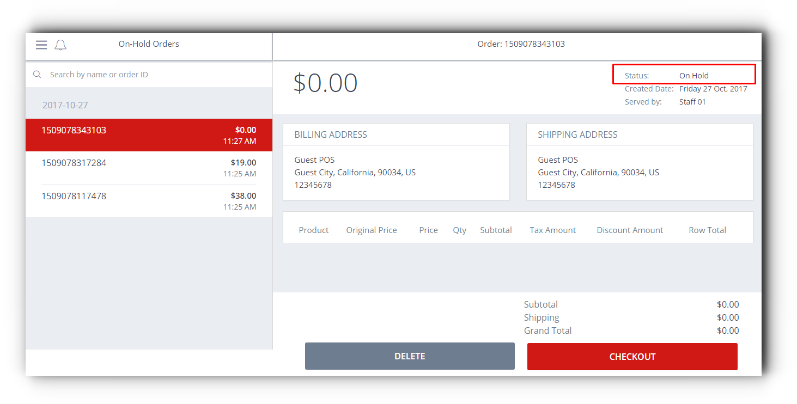
 
* **In Magento Backend**

If you turn on Sync on-hold order to server setting in **WebPOS Frontend top left menu > Settings** section **> General > Checkout**, you will be able to see on-hold orders in **Magento backend > Sales > Orders**.

 
##### Print Receipt and Email Order Information
You can print receipt or email order information right after creating an order. Remember that you must be online and have permission to do these actions

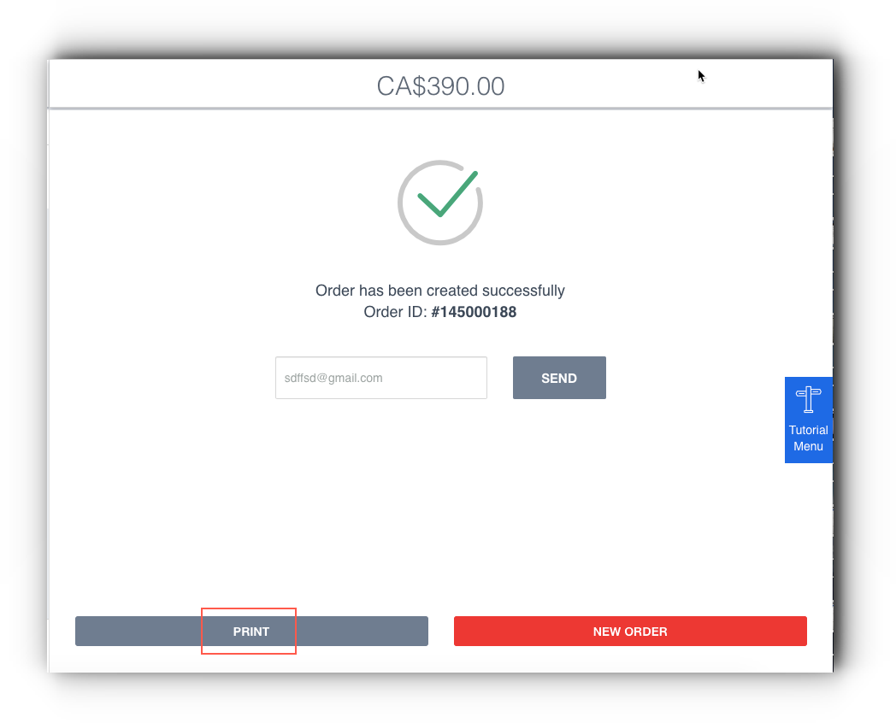
 
The receipt will look like the screenshot below:

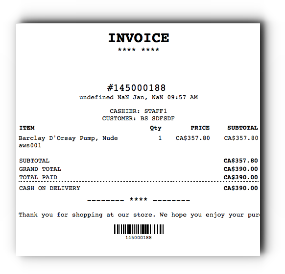

And here is the email of order information:

##### Review Orders 

###### a.	Order Status 

_Path: **Web POS menu > Orders > Order history** tab_

Here you can see the order list and order details:

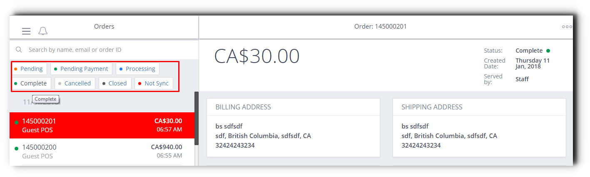
 
In order list, the status of order is distinguished by color:

* **Complete**: Green (When you have shipped order AND created invoice)
* **Processing**: Blue (When you have shipped order OR created invoice)
* **Pending**: Orange (When you create order successfully but have not shipped order and created invoice)
* **Canceled**: Gray (When you cancel the order)
* **Not synced**: Red (When order’s data has not been synced to the system)
* **Closed**: Black (When order has been refunded)

You can filter all orders of the same status by clicking on the status.

###### b.	Order Searching
To quickly find an order to review, you can search it by Order ID or Customer’s Name/Email

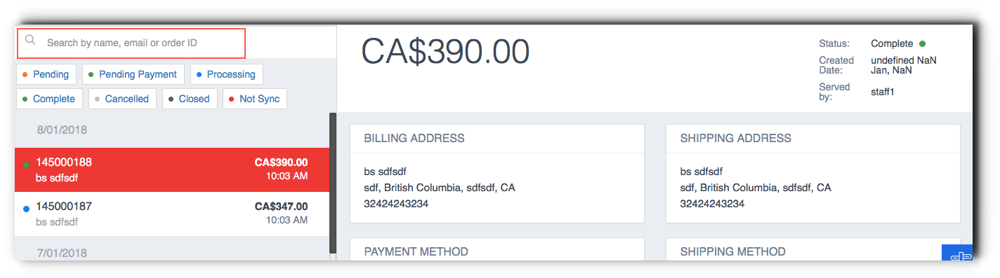
 
###### c.	View Order Information
To view detailed information, click on your wanted order. Please make sure that you have permission to check it. The detailed order will be shown like this:

 

##### Creat Shipment For Order
###### a.	Create Shipment

There are two ways to create shipment using Web POS: **before placing an order** and **when reviewing order**

* **Before Placing An Order:**

Before an order is created by clicking **Place Order** button, you can create shipment by turning on **Mark as Shipped** as below:

 
After verifying shipment method, the system will automatically load to Successful Order Page. There will be a message shown to notify you that shipment is created successfully. Please note that you need to have permission and be in online mode.

* **After Placing Order:**
When order has been created successfully but hasn’t been shipped, you can go to **Order History** (path: from top left menu icon > **Orders** section **> Orders History**), select an order and create shipment for that order.

 
###### b.	Partial Shipment 
If the customer want the order to be shipped in 2 or more consignments, sales staff can enable Partial Shipment function. 

**NOTE**: When you create order, remember to turn off button **Mark as shipped**.

_Path: **Web POS top left icon menu > Orders > Order history** tab_

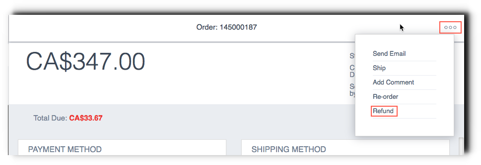
 
Then you click on the menu icon on the right corner and choose **Ship**. A pop-up then appears so you can enter the number of items to be shipped of each product and click **Submit Shipment** to finish. 

**Note**: Only orders that have been synced can be shipped.

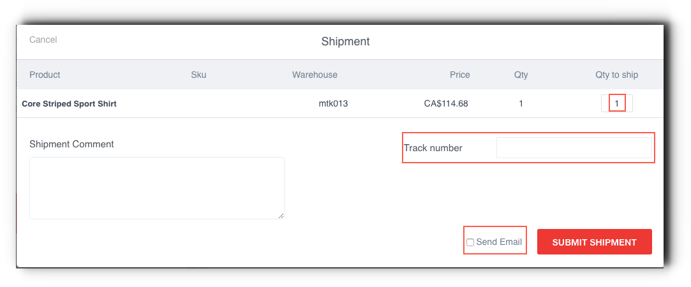
 

#### How To Issue Refund 

_Path: **Web POS top left menu > Orders > Order history** tab_ 

Select a specific order, click on the top right menu icon and choose **Refund**.

**NOTE**: Only certain staffs have permission to issue refund (which is set by admin in backend). And you can only refund orders with **Processing** or **Complete** status.

 
After tapping on **Refund**, a popup will display so that you can fill in the information before making refund. 

 
1. Enter the quantity to refund 
2. Tick **Return to stock** if you want to return those items back to warehouse.
3. Enter additional note if it were essential
4. Enter additional info including:
* **Adjust Refund**: The compensation customers get from your store if they have to request refund.
* **Adjust Fee**: The fee customers might have to pay for your store when requesting refund

5. Enter additional info including:
* **Adjust Refund**: The compensation customers get from your store if they have to request refund.
* **Adjust Fee**: The fee customers might have to pay for your store when requesting refund

After that, you will get the message informing that credit memo is created successfully.

**NOTE**: Please make sure you have permission to issue refund and you are in online mode.

#### How To Review Report 

_Path: **Magento Backend Menu > Sales > Web POS** section **> Reports**_
There will be 4 types of reports helping admin manage stores’ productivity: **Staff Report, Location Report, Payment Report** and **Z- Report**. 
 
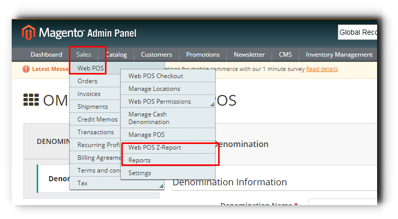

##### Staff Report

On **Staff report** section, there are 3 types of reports: **Sales by staff, Sales by staff (Daily)** and **Order list by staff**. 

 
*	**Sales by staff**
It shows the number of orders and total sales created by each sale staff in any custom period.
You can user filter to show report effectively according to the manger’s demand.
There are 2 categories being used for this filter: **date** and **order status**

 
After filling in those field, please don’t forget to tap on **Show Report** button to bring out results quickly and conveniently. They will be displayed on the screen like this screeshot: 

 
* **Sales by staff (daily)**

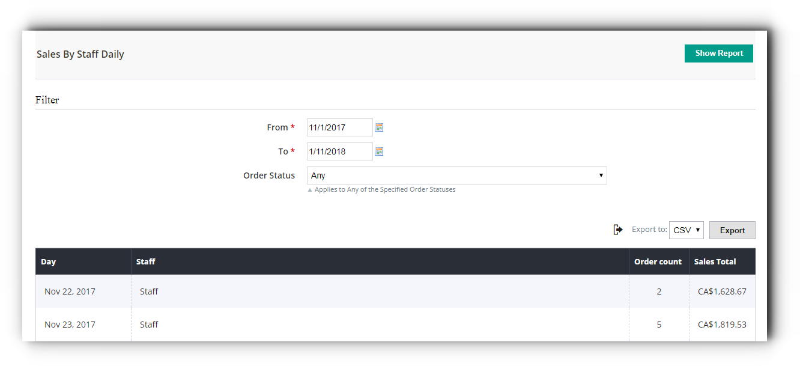
 
It shows the number of orders and total sales created by each staff each day in the time period that you choose.
It is as same as the filter you use in **Sales by staff**, so please refer to this previous part to know how to use filter. 

* **Order list by staff**

It will list out orders which is created by a specific staff. 
As those previous parts above, to bring out reports, users can also use filter to have the statistic quickly and conveniently. 

 
After filling in those fields, please do not forget to tap Show Report on the left side of the screen to show the results. 
And here it is: 

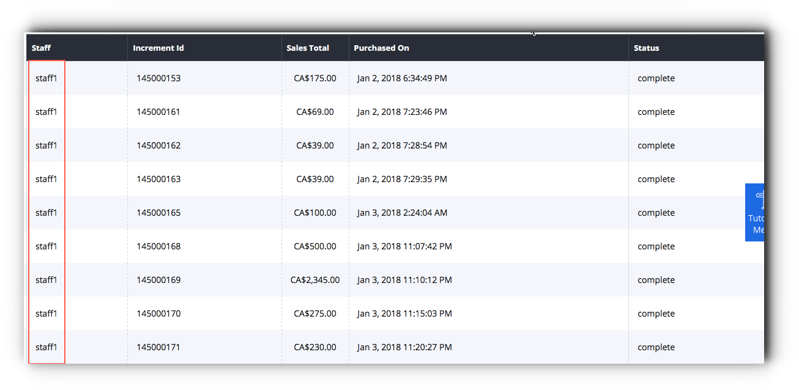
 
As you can see on the screenshot above, report show all the orders which are created by staff 1 from 01/01/2018 to 01/08/2018 with the oder status selected is Complete

##### Location Report 
There are 3 types or Report in the **Location Report** section: **Sales by location, Sales by location (daily)** and **Order list by location**

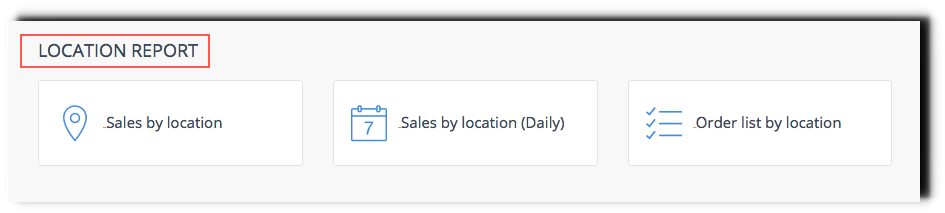
 
* **Sales by location**
This report shows shows the number of orders and sales created in each location, in any custom time period.
 
This example above shows us the statistic of POS has the default location with total orders is 37 and sales total is $9,431,000 in cash. 

* **Sales by location (daily)**

 
It shows the number of orders and sales created in each location by each day.
This report uses the same filter as **Sales by location**, so please refer this part to see more details. 

* **Order list by location**

In the Order list for location, you can view all order information including ID, value, history and status of each order created by all or each specific sale location.
 
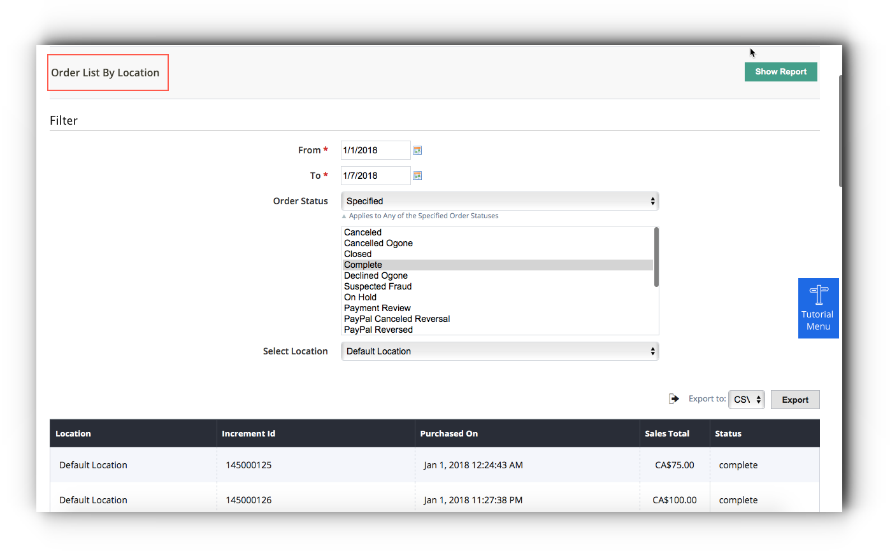

##### Payment Report 

The section of Payment Report has 4 different types of report including Sales by payment method, Sales by payment method (Daily), Order list for payment method and Sales by payment method for location. 
 
•	Sales by Payment Method
The Sales by payment method report displays the number of orders and sales paid by each payment method in a custom time period.
 

•	Sales by Payment (Daily)
 
The Sales by payment (Daily) report shows the number of orders and sales created by each payment method by each day.
•	Order List for Payment Method
And in the Order list for payment method, you can view all order information including ID, value, history and status of each order created by all or each specific payment method
 

•	Sales by payment method for location
 
The Sales by payment method for location report displays the number of orders and sales created by each payment in each sale location.

5.2.7.4.	Z- Report
Path: Magento POS Backend > Sales > Web POS > Web POS Z-Report
 
 
Z-report shows the cash drawer balance in a certain time like a shift or a working day. All payment methods are listed down with the record of Grand Total in details respectively. If there is no customer use Cash on Delivery method to purchase orders, it will not appear in the Payment Method section.
The Z-report will be refreshed to serve new shift/working day after you select Close Store. Particularly, your cash drawer will be reset to 0 or to the certain amount that you set up in Cash Left. Each Z-report is automatically saved in Magento backend so you can check it again.

 

